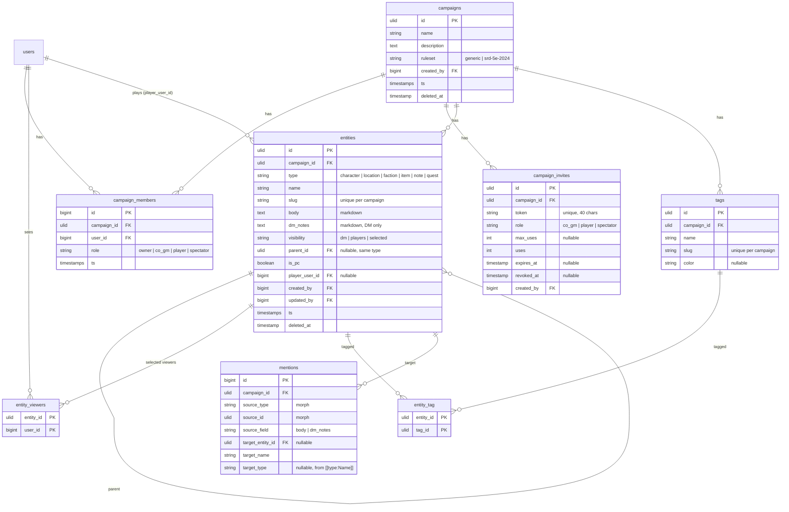

# feat: Campaigns, members, invites, and entities foundation

## Overview

This is MVP slice 1 of demgem. It lays the foundation every later slice builds on: accounts, campaigns, membership with roles, shareable invite links, and the entity system (characters, locations, factions, items, notes, quests) with a Markdown body, Obsidian-style `[[Wiki Links]]`, backlinks, private DM notes, per-entity visibility, tags, nesting, images, and campaign-scoped search.

When this slice is done, a DM can register, create a campaign, invite players with a link, write a linked wiki of their world, hide what players must not see, and search it. Sessions, quests-with-objectives, the initiative tracker, and dice come in slice 2 and 3.

## Problem Statement

A DM today spreads a campaign across Notion or Obsidian for notes, a separate app for combat, and Discord for the group. Nothing owns the prep, play, recap loop. demgem will. But the loop needs a place to store the world and a way to share the right parts of it with players. That is this slice.

## Proposed Solution

Build the campaign container, its membership model, and the entity wiki as a fully custom Livewire UI on Laravel 13. Every campaign-scoped model carries `campaign_id`, a global scope, and a policy that checks the member's role. Visibility is a first-class column with one query scope that every listing surface uses. Wiki links are parsed on save into a `mentions` table. That table drives backlinks, rename propagation, and "create this entity" prompts.

## Technical Approach

### Stack decisions

| Layer | Choice | Version (checked 2026-09-02) | Notes |
|---|---|---|---|
| Framework | Laravel | 13.30.1, PHP 8.4 | Scaffolded. `VerifyCsrfToken` is now `PreventRequestForgery`. |
| UI | Livewire + Alpine + Tailwind 4 | Livewire 4.4.x | Install `livewire/livewire` directly. Do not use the official starter kit; it depends on Flux. |
| Auth | Fortify | 1.39 | Headless. Custom Blade views. Enable registration, password reset, profile and password update. Defer email verification, 2FA, and passkeys. |
| Markdown | league/commonmark | 2.10 | Custom `WikiLinkExtension`. `html_input: strip`, `allow_unsafe_links: false`, `max_nesting_level: 50`. |
| Search | Scout database driver | Scout 11.6 | Uses `ILIKE` on Postgres automatically. No ranking. Good enough for MVP. |
| Media | spatie/laravel-medialibrary | 11.23 | One image collection on campaigns and entities. Local disk in dev, S3 in production. |
| IDs | `HasUlids` on campaign-scoped models | | Users keep the scaffold's bigint id. |
| Tests | Pest + pest-plugin-laravel | Pest 5.1, plugin 5.0.1 | Replace PHPUnit. SQLite in-memory for this slice. |
| Quality | Pint, Larastan | | Level 6 to start. |
| Database | PostgreSQL in dev and production | | Keep migrations portable so SQLite tests work. |

### Livewire component style

Use class-based components with separate Blade views, not single-file components. Larastan and Pint cover plain PHP classes. Single-file components are the `make:livewire` default in 4.x, so pass the flag that produces a class. Check the 4.x docs for the exact flag when work starts.

### Architecture

#### Tenancy and authorization

The campaign is the tenant. Three layers, all required:

1. **Scoped route bindings.** Every campaign route lives under `/campaigns/{campaign}` with `scopeBindings()`. A mismatched entity 404s at the router.
2. **Member middleware.** `EnsureCampaignMember` runs after binding. Non-members get 404, not 403, so the campaign's existence is not confirmed. The middleware stores the campaign and the viewer's role in a `CurrentCampaign` singleton.
3. **Global scope plus policies.** `BelongsToCampaign` trait adds `campaign_id`, the `campaign()` relation, and a global scope that filters by `CurrentCampaign` when one is set. Policies check the role for that campaign. Jobs and commands must set `CurrentCampaign` explicitly before they query.

Rule for contributors: never call `Entity::find()` or `Entity::query()` outside a campaign context.

#### Roles

`CampaignRole` enum: `owner`, `co_gm`, `player`, `spectator`. `owner` and `co_gm` are DM roles. Exactly one owner per campaign. Ownership lives only in `campaign_members.role`. There is no `owner_id` column.

| Action | owner | co_gm | player | spectator |
|---|---|---|---|---|
| View campaign and visible entities | yes | yes | yes | yes |
| Create, edit, delete entities | yes | yes | own PC only | no |
| See DM notes and hidden entities | yes | yes | no | no |
| Create and revoke invites | yes | yes | no | no |
| Remove players and spectators | yes | yes | no | no |
| Change roles, remove co_gm | yes | no | no | no |
| Transfer ownership | yes | no | no | no |
| Edit campaign settings | yes | yes | no | no |
| Delete campaign | yes | no | no | no |
| Leave campaign | no, must transfer first | yes | yes | yes |

#### Data model



Notes on the model:

- **Unique constraints.** `entities (campaign_id, slug)` unique at the DB level. Name uniqueness per `(campaign_id, type)` is case-insensitive and ignores trashed rows, so enforce it with a validation rule, not an index.
- **Slugs** derive from the name. On collision within the campaign, including trashed rows, append `-2`, `-3`. A rename regenerates the slug. Old URLs may break in this slice. That is acceptable.
- **Soft deletes** on `campaigns` and `entities`. Hard delete on members, invites, tags, mentions.
- **Deleting an entity** reparents its children to its own parent and sets `mentions.target_entity_id` to null for rows that pointed at it. The `target_name` stays, so the link becomes unresolved rather than broken.
- **Mentions are polymorphic** on the source so slice 2 can index session recaps and quest bodies without a migration.
- **Media** uses the spatie `media` table. Collections: `cover` on campaigns, `image` on entities.

#### Visibility model

- `visibility = dm`: DM roles only.
- `visibility = players`: every member.
- `visibility = selected`: DM roles plus users in `entity_viewers`.
- A player always sees their own PC, whatever its visibility.
- `dm_notes` is never rendered, serialized, searched, or previewed for non-DM roles.

One scope enforces it:

```php
// app/Models/Entity.php
public function scopeVisibleTo(Builder $query, User $user, CampaignRole $role): Builder
{
    if ($role->isDm()) {
        return $query;
    }

    return $query->where(function (Builder $q) use ($user) {
        $q->where('visibility', Visibility::Players)
          ->orWhere('player_user_id', $user->id)
          ->orWhere(fn (Builder $s) => $s
              ->where('visibility', Visibility::Selected)
              ->whereHas('viewers', fn ($v) => $v->where('user_id', $user->id)));
    });
}
```

Every one of these surfaces calls `visibleTo()`: entity index, search, autocomplete, backlinks panel, tag filter counts, parent and child lists, breadcrumbs. `EntityPolicy::view` repeats the same check for direct URL access. Hidden ancestors are omitted from breadcrumbs. Unauthorized entity URLs return 404.

#### Wiki links and mentions

Syntax in Markdown: `[[Name]]`, `[[Name|label]]`, `[[type:Name]]`, `[[type:Name|label]]`.

- **Parse on save.** `SyncMentions` action runs in the entity observer. It deletes the entity's outbound mention rows and rebuilds them from `body` (field `body`) and `dm_notes` (field `dm_notes`).
- **Resolve** by case-insensitive name within the campaign. With a type prefix, match that type only. Without a prefix and with more than one match, pick by type priority: character, location, faction, item, quest, note. The autocomplete always writes the prefix when a name exists in more than one type, so ambiguity only arises from hand-typed links.
- **Unresolved links** are stored with `target_entity_id = null` and the typed name. When a new entity is created, `ResolveMentionsFor($entity)` finds rows with a matching name and links them. That is how "create this entity" works: the DM clicks the prompt, the form pre-fills the name and type, and the save resolves every pending mention.
- **Render.** `WikiLinkExtension` for commonmark. The renderer receives a resolver bound to the viewer. A resolved link the viewer can see renders as `<a>`. A resolved link the viewer cannot see renders as plain text. An unresolved link renders as a "create" prompt for DM roles and plain text for everyone else.
- **Backlinks** on an entity page: mentions where `target_entity_id` is this entity, joined to source entities filtered by `visibleTo()`, and with `source_field = dm_notes` rows excluded for non-DM viewers.
- **Rename.** When `name` changes, `RewriteWikiLinks` finds every source that mentions the entity and rewrites `[[Old]]`, `[[Old|`, and `[[type:Old` to the new name, case-insensitively, preserving labels. It runs synchronously in the update transaction. Campaigns are small.

```php
// app/Markdown/WikiLink/WikiLinkParser.php
final class WikiLinkParser implements InlineParserInterface
{
    public function getMatchDefinition(): InlineParserMatch
    {
        return InlineParserMatch::regex('\[\[(?:([a-z]+):)?([^\]|]+)(?:\|([^\]]+))?\]\]');
    }

    public function parse(InlineParserContext $ctx): bool
    {
        $ctx->getCursor()->advanceBy($ctx->getFullMatchLength());
        [$type, $name, $label] = array_pad($ctx->getSubMatches(), 3, null);
        $ctx->getContainer()->appendChild(new WikiLink(trim($name), $type ?: null, $label));

        return true;
    }
}
```

```php
// app/Markdown/MarkdownRenderer.php
public function render(string $markdown, LinkResolver $resolver): string
{
    return Str::markdown($markdown, [
        'html_input' => 'strip',
        'allow_unsafe_links' => false,
        'max_nesting_level' => 50,
    ], [new WikiLinkExtension($resolver)]);
}
```

Render on every page view in this slice. Cache rendered HTML per viewer role later if it shows up in profiling.

#### Routes

```php
// routes/web.php
Route::middleware('auth')->group(function () {
    Route::livewire('/campaigns', 'pages::campaigns.index')->name('campaigns.index');
    Route::livewire('/campaigns/create', 'pages::campaigns.create')->name('campaigns.create');

    Route::get('/invites/{token}', [InviteController::class, 'show'])->name('invites.show');
    Route::post('/invites/{token}', [InviteController::class, 'accept'])
        ->middleware('throttle:20,1')->name('invites.accept');

    Route::prefix('/campaigns/{campaign}')
        ->middleware(EnsureCampaignMember::class)
        ->scopeBindings()
        ->group(function () {
            Route::livewire('/', 'pages::campaigns.show')->name('campaigns.show');
            Route::livewire('/settings', 'pages::campaigns.settings')->name('campaigns.settings');
            Route::livewire('/members', 'pages::campaigns.members')->name('campaigns.members');
            Route::livewire('/search', 'pages::search')->name('search');
            Route::get('/autocomplete', AutocompleteController::class)->name('entities.autocomplete');

            Route::livewire('/{type}/create', 'pages::entities.form')->name('entities.create');
            Route::livewire('/{type}', 'pages::entities.index')->name('entities.index');
            Route::livewire('/{type}/{entity:slug}', 'pages::entities.show')->name('entities.show');
            Route::livewire('/{type}/{entity:slug}/edit', 'pages::entities.form')->name('entities.edit');
        })
        ->whereIn('type', EntityType::slugs());
});
```

`{type}` is the plural slug: `characters`, `locations`, `factions`, `items`, `notes`, `quests`. Campaign URLs use the ULID. Humans navigate through the UI, not the address bar.

#### Invite flow

1. Owner or co_gm creates an invite on the members page: role, optional expiry, optional max uses. Token is `Str::random(40)`.
2. Anyone opens `/invites/{token}`. The `auth` middleware redirects guests to login with the intended URL stored. A custom `RegisterResponse` honors the intended URL, because Fortify's default does not.
3. The show page reveals only the campaign name and cover image. Never entity data.
4. Accept: in a transaction, lock the invite row, check `revoked_at`, `expires_at`, and `uses < max_uses`, create the membership, increment `uses`. Expired, exhausted, revoked, and unknown tokens all show the same "this invite is not valid" page.
5. Existing members, including the owner, see "you are already a member" and the link's role is ignored.
6. Removed users can rejoin through a still-valid link. There is no ban list in this slice. The members page tells the owner to revoke links after removing someone.

#### UI structure

Layout `resources/views/layouts/app.blade.php`: left sidebar with the campaign name, one nav item per entity type with counts, members, settings. Top bar with campaign switcher, search box, user menu, theme toggle. Content area with breadcrumbs.

Blade UI kit in `resources/views/components/ui/`: `button`, `input`, `textarea`, `select`, `checkbox`, `badge`, `card`, `modal` (Alpine), `dropdown` (Alpine), `tabs`, `empty-state`, `alert`, `avatar`, `kbd`. No external component library. Tailwind 4 design tokens in `resources/css/app.css` via `@theme`. Dark mode with `data-theme` on `<html>`, an Alpine toggle, and localStorage persistence.

Markdown editor: `x-markdown-editor` Blade component. Textarea bound with `wire:model`. Alpine handles the toolbar, and a `[[` or `@` trigger that queries the autocomplete route and inserts `[[Name]]` or `[[type:Name]]`. A preview tab calls a Livewire `preview()` method with a 500ms debounce. One renderer, server-side.

Load the `frontend-design` and `ui-ux-pro-max` skills before you build the layout and the kit. The brief: a DM's reference tool, readable on a tablet at the table, dark by default, dense but calm.

### Decisions resolved from spec-flow analysis

| Question | Decision |
|---|---|
| Source of truth for ownership | `campaign_members.role`. No `owner_id`. Exactly one owner. |
| Ownership transfer | Owner picks a member. One transaction: member becomes owner, old owner becomes co_gm. |
| Last owner leaving | Blocked. Transfer first. Co_gm cannot touch the owner. |
| Player PC field permissions | Player edits name, body, image, and tags. DM roles edit visibility, dm_notes, parent, is_pc, player_user_id. |
| PC when player leaves | Entity stays. `player_user_id` set to null. |
| Rejoin after removal | Allowed via a valid link. No ban list yet. |
| Soft vs hard delete | Soft on campaigns and entities. Hard on the rest. Restore UI is P2. |
| Entity delete with children | Reparent children to the grandparent. |
| Ambiguous bare `[[Name]]` | Fixed type priority. Autocomplete writes the prefix on collision. |
| Unresolved link for players | Plain text. |
| Link to a hidden entity | Plain text, no href, no title attribute. |
| DM-notes mentions | Recorded with `source_field = dm_notes`. Hidden from non-DM backlinks. |
| Search fields | `name` and `body` only. `dm_notes` is not searchable in this slice. |
| Tag counts | Computed per viewer through `visibleTo()`. No cached counts. |
| Hidden parent, visible child | Allowed. Breadcrumb omits hidden ancestors. |
| Unauthorized entity URL | 404. |
| Campaign delete | Owner types the campaign name to confirm. Soft delete. |
| Concurrent invite accepts | Row lock in a transaction. |

### Implementation Phases

Each phase ends with green tests. Do not start the next phase with a red suite.

#### Phase 0: Tooling

Deliverables:
- Laravel Boost installed. The user runs this because it is interactive:
  ```sh
  composer require laravel/boost --dev
  php artisan boost:install
  ```
- Pest replaces PHPUnit:
  ```sh
  composer remove phpunit/phpunit
  composer require pestphp/pest --dev --with-all-dependencies
  ./vendor/bin/pest --init
  composer require --dev pestphp/pest-plugin-laravel
  ```
- `composer require livewire/livewire laravel/fortify league/commonmark laravel/scout spatie/laravel-medialibrary`
- `composer require --dev larastan/larastan` with `phpstan.neon` at level 6.
- `.env` switched to `DB_CONNECTION=pgsql` with a local Postgres. Tests use SQLite in-memory via `phpunit.xml`.
- `php artisan livewire:layout`, `fortify:install`, `vendor:publish` for Scout and media library.
- Composer scripts: `test`, `lint` (Pint), `analyse` (Larastan).

Files: `composer.json`, `phpunit.xml`, `tests/Pest.php`, `phpstan.neon`, `.env.example`, `config/fortify.php`, `config/scout.php`, `config/media-library.php`.

Success: `composer test` runs one passing Pest test. `composer analyse` passes.

#### Phase 1: Auth and app shell

Deliverables:
- Fortify views: `resources/views/auth/login.blade.php`, `register.blade.php`, `forgot-password.blade.php`, `reset-password.blade.php`. Registered in `app/Providers/FortifyServiceProvider.php`.
- `app/Http/Responses/RegisterResponse.php` that redirects to the intended URL.
- Guest layout `resources/views/layouts/guest.blade.php`.
- App layout with sidebar, top bar, theme toggle.
- UI kit components listed above.
- Profile page: update name, email, password. `pages::profile`.

Tests: `tests/Feature/Auth/RegistrationTest.php`, `LoginTest.php`, `PasswordResetTest.php`, `tests/Feature/ProfileTest.php`.

Success: a user can register, log in, reset a password, update their profile, and toggle dark mode.

#### Phase 2: Campaigns, members, invites

Deliverables:
- Migrations: `create_campaigns_table`, `create_campaign_members_table`, `create_campaign_invites_table`.
- Models: `app/Models/Campaign.php`, `CampaignMember.php`, `CampaignInvite.php`. Enums: `app/Enums/CampaignRole.php`, `Ruleset.php`.
- `app/Support/CurrentCampaign.php` singleton. `app/Http/Middleware/EnsureCampaignMember.php`. `app/Models/Concerns/BelongsToCampaign.php`.
- `app/Policies/CampaignPolicy.php`.
- Actions: `app/Actions/Campaigns/CreateCampaign.php`, `TransferOwnership.php`, `RemoveMember.php`, `LeaveCampaign.php`, `DeleteCampaign.php`. `app/Actions/Invites/CreateInvite.php`, `AcceptInvite.php`, `RevokeInvite.php`.
- Livewire pages: `campaigns.index`, `campaigns.create`, `campaigns.show` (dashboard with entity counts and recent activity), `campaigns.settings` (name, description, ruleset, cover, transfer, delete), `campaigns.members` (roster, role changes, remove, invites list, create invite, copy link).
- `app/Http/Controllers/InviteController.php` and `resources/views/invites/show.blade.php`, `invalid.blade.php`.
- Factories for all three models.

Tests: `tests/Feature/Campaigns/CreateCampaignTest.php`, `CampaignSettingsTest.php`, `DeleteCampaignTest.php`, `tests/Feature/Members/RolePermissionsTest.php` (the full matrix above), `TransferOwnershipTest.php`, `LeaveCampaignTest.php`, `tests/Feature/Invites/CreateInviteTest.php`, `AcceptInviteTest.php` (guest, registered, already member, expired, exhausted, revoked, concurrent), `tests/Feature/Tenancy/CampaignIsolationTest.php` (member of A cannot reach B by URL; gets 404).

Success: two users in two campaigns cannot see each other's campaigns. The role matrix passes.

#### Phase 3: Entities core

Deliverables:
- Migrations: `create_entities_table`, `create_entity_viewers_table`, `create_tags_table`, `create_entity_tag_table`.
- `app/Models/Entity.php` with `HasUlids`, `SoftDeletes`, `BelongsToCampaign`, `visibleTo()` scope, `parent()`, `children()`, `viewers()`, `tags()`, `player()`. `app/Models/Tag.php`.
- Enums: `app/Enums/EntityType.php` (label, plural, slug, icon, priority), `Visibility.php`.
- `app/Policies/EntityPolicy.php` with `view`, `create`, `update`, `delete`, `viewDmNotes`, `updateDmFields`.
- Actions: `app/Actions/Entities/CreateEntity.php`, `UpdateEntity.php`, `DeleteEntity.php` (reparent children), `GenerateSlug.php`, `SyncTags.php`.
- Validation: `app/Rules/UniqueEntityName.php` (case-insensitive, per type, ignores trashed).
- Livewire pages: `entities.index` (list per type, filter by tag and visibility, sort), `entities.show` (body, sidebar with type, parent, children, tags, viewers, image; DM notes panel for DM roles), `entities.form` (create and edit; DM fields hidden for players editing a PC).
- Route `whereIn('type', ...)` constraint and an `EntityType` route binding helper.
- `database/seeders/DemoCampaignSeeder.php` with a small linked world for development.

Tests: `tests/Feature/Entities/CreateEntityTest.php`, `UpdateEntityTest.php`, `DeleteEntityTest.php` (reparenting), `EntityVisibilityTest.php` (every branch of the scope, PC exception, 404 on hidden), `DmNotesTest.php` (never in player HTML or preview), `PlayerEditsOwnPcTest.php` (allowed fields only), `TagsTest.php` (per-campaign namespace, per-viewer counts), `NestingTest.php` (same-type parent only, hidden ancestor omitted from breadcrumb), `UniqueEntityNameTest.php`.

Success: a DM creates entities of each type, hides one, and a player cannot reach it by list or URL.

#### Phase 4: Markdown, wiki links, mentions

Deliverables:
- Migration: `create_mentions_table`.
- `app/Models/Mention.php`.
- `app/Markdown/MarkdownRenderer.php`, `app/Markdown/LinkResolver.php`, `app/Markdown/WikiLink/WikiLinkExtension.php`, `WikiLinkParser.php`, `WikiLink.php`, `WikiLinkRenderer.php`.
- `app/Markdown/WikiLinkScanner.php`: extracts `[[...]]` tokens from Markdown without rendering. Used by mention sync and rename.
- Actions: `app/Actions/Mentions/SyncMentions.php`, `ResolveMentionsFor.php`, `RewriteWikiLinks.php`.
- `app/Observers/EntityObserver.php`: saved → SyncMentions; created → ResolveMentionsFor; name changed → RewriteWikiLinks; deleted → null out targets.
- `app/Http/Controllers/AutocompleteController.php`: JSON `{name, type, slug, needsPrefix}` through `visibleTo()`, max 10 results.
- `x-markdown-editor` Blade component with Alpine autocomplete and preview.
- Backlinks panel on `entities.show`.
- "Create this entity" prompt: link to `entities.create` with `?name=` and the type from the prefix or a picker.

Tests: `tests/Unit/Markdown/WikiLinkParserTest.php` (all four syntaxes, escaping), `MarkdownSecurityTest.php` (raw HTML stripped, `javascript:` blocked), `tests/Feature/Mentions/SyncMentionsTest.php`, `ResolveOnCreateTest.php`, `RenameRewritesLinksTest.php` (labels preserved, case-insensitive, prefix form), `DeleteUnresolvesLinksTest.php`, `BacklinksVisibilityTest.php` (hidden source excluded, dm_notes source excluded for players), `AmbiguityTest.php` (priority order, prefix wins), `AutocompleteTest.php` (visibility filter, needsPrefix flag), `RenderedLinksTest.php` (hidden target renders plain text for player, create prompt only for DM).

Success: rename an NPC that three locations mention and all three bodies update. A player sees no trace of a DM-only entity through links, backlinks, or autocomplete.

#### Phase 5: Search and images

Deliverables:
- Scout on `Entity`: `toSearchableArray()` returns `name` and `body`. `search` page queries `Entity::search($q)->where('campaign_id', ...)->query(fn ($q) => $q->visibleTo(...))`.
- Global search box in the top bar with keyboard shortcut.
- Media library on `Campaign` (`cover`) and `Entity` (`image`) with a `thumb` conversion. Upload through Livewire `WithFileUploads` on the settings and entity forms.
- `config/filesystems.php` S3 disk documented in `.env.example`.

Tests: `tests/Feature/SearchTest.php` (campaign scoped, visibility filtered, dm_notes never matched), `tests/Feature/Media/EntityImageTest.php`, `CampaignCoverTest.php` (fake storage).

Success: search for a word in a hidden entity's body as a player returns nothing.

#### Phase 6: Polish

- Empty states for every list. Friendly 404 page. Flash messages.
- Keyboard: `/` focuses search, `n` opens new entity on an index page.
- Responsive pass at tablet and phone widths.
- README: install steps, `.env` keys, `composer test`, contribution notes, SRD attribution placeholder.
- Run Pint, Larastan, and the full suite. Fix everything.

## Alternative Approaches Considered

- **Kanka-style ID links `[entity:123]`.** Stable across renames and never ambiguous. Rejected because the brainstorm chose Obsidian-compatible Markdown for export and import. Rename propagation and the mentions table cover the gap.
- **Separate tables per entity type.** Cleaner per-type columns. Rejected. Six types share the same fields in this slice. One table keeps links, search, tags, and visibility in one place. Add child tables when a type needs relational data, for example quest objectives in slice 3.
- **Signed URLs for invites.** No table needed. Rejected because expiry, max uses, and revocation need a row anyway.
- **spatie/laravel-tags.** Scopes by model type, not tenant. Rejected for a custom two-table design.
- **Render-time link resolution.** Rejected. A mentions table is needed for backlinks and rename anyway, so parse on save.
- **Filament for admin screens.** Rejected by the author.

## Acceptance Criteria

### Functional

- [x] A visitor registers, logs in, logs out, and resets a password through custom views.
- [x] A user creates a campaign and is its only owner.
- [x] Owner or co_gm creates an invite with role, optional expiry, and optional max uses, and copies the link.
- [x] A guest opens an invite, registers, and lands back on the accept page as a member with the invite's role.
- [x] Expired, exhausted, revoked, and unknown invites show one identical error page.
- [x] The role matrix above holds for every action, checked by tests.
- [x] The sole owner cannot leave or be removed. Ownership transfer works in one step.
- [x] Every entity type supports create, edit, soft delete, nesting under a parent of the same type, tags, one image, and DM notes.
- [x] Visibility `dm`, `players`, and `selected` behave as specified on lists, pages, search, autocomplete, backlinks, tag counts, and breadcrumbs.
- [x] A player can edit only name, body, image, and tags of their own PC.
- [x] `[[Name]]`, `[[Name|label]]`, `[[type:Name]]`, and `[[type:Name|label]]` render as links, plain text, or a create prompt according to the rules above.
- [x] Backlinks list on every entity page, filtered by viewer.
- [x] Renaming an entity rewrites links in every body and DM-notes field that mentions it.
- [x] Creating an entity resolves earlier unresolved links to its name.
- [x] Search is scoped to the campaign and to what the viewer may see.
- [x] Members of one campaign get 404 on another campaign's URLs.

### Non-functional

- [x] Raw HTML in Markdown is stripped. `javascript:` links are blocked. Rendered HTML is echoed unescaped only from the renderer.
- [x] Invite accept is rate limited.
- [x] No N+1 queries on entity index, entity show, and members pages. Strict mode (`Model::shouldBeStrict`) is on outside production, so a lazy load in a list throws in tests.
- [x] Every page works at 768px width in dark and light themes. Checked in Chrome on the entity page.

### Quality gates

- [x] Pest suite green. Feature tests cover every policy branch and every visibility surface.
- [x] Larastan level 6 clean. Pint clean.
- [x] README documents setup and the contributor rule about campaign context.

## Dependencies & Risks

| Risk | Mitigation |
|---|---|
| Livewire 4 conventions differ from v3 knowledge | Read the 4.x docs on routing, layouts, and component generation before Phase 1. Boost's guidelines help. |
| Global scope silently absent in jobs or commands | Decided during the build: the scope applies only when `CurrentCampaign` is set, and never throws, so relationship queries in tests and seeders keep working. Policies and scoped route bindings are the second line. Jobs set the context explicitly. |
| Visibility leak through a surface nobody listed | Keep the surface checklist in `EntityPolicy` docblock. Add a test whenever a new query on `entities` appears. |
| Rename rewrite corrupts a body | Scanner only replaces exact `[[` tokens. Tests cover labels, prefixes, and case. |
| SQLite tests hide Postgres-only behavior | It happened once: the media table used bigint morphs against ULID keys and only Postgres complained. Fixed by `ulidMorphs`. Add a Postgres CI job before slice 2. |
| Fortify register redirect ignores intended URL | Custom `RegisterResponse`. Test the guest invite flow end to end. |
| Commonmark attributes extension XSS (CVE-2025-46734) | Do not enable the attributes extension. Pin commonmark to 2.7 or newer. |

## Future Considerations

- Slice 2: sessions with Lazy DM prep, secrets and clues, live notes, recap. Mentions already accept polymorphic sources.
- Slice 3: quests with objectives and status. Adds `quest_objectives` keyed by entity id.
- P2: `:::secret` blocks, entity history, Reverb, JSON and Markdown export, ban list on removal, restore from trash, cached rendered HTML.
- Hosted: Cashier plans, storage quotas, Postgres full-text search with `SearchUsingFullText`.

## References

### Internal

- Brainstorm: `docs/brainstorms/2026-09-02-demgem-campaign-manager-brainstorm.md`
- Scaffold guidance: `CLAUDE.md`, `AGENTS.md` (Boost)

### External

- Laravel 13 docs: https://laravel.com/docs/13.x (routing scoped bindings, Eloquent `HasUlids`, Fortify, Scout, strings)
- Fortify custom views: https://laravel.com/docs/13.x/fortify
- Livewire 4 docs: https://livewire.laravel.com/docs/4.x
- Livewire starter kit composer.json (uses Flux, avoid): https://github.com/laravel/livewire-starter-kit
- CommonMark security: https://commonmark.thephpleague.com/2.x/security/
- CommonMark inline parsing: https://commonmark.thephpleague.com/2.x/customization/inline-parsing/
- CVE-2025-46734: https://github.com/advisories/GHSA-3527-qv2q-pfvx
- Scout database engine source: https://github.com/laravel/scout
- spatie/laravel-medialibrary docs: https://spatie.be/docs/laravel-medialibrary/v11
- Pest installation: https://pestphp.com/docs/installation
- Invite flow for existing or new users: https://laraveldaily.com/lesson/laravel-multi-tenancy/accept-invitation-register
- Team-based single-database tenancy: https://laraspeed.dev/blog/laravel-multi-tenancy-teams-guide
- Scoped route bindings: https://laravel-news.com/route-resource-scoped
- Obsidian backlinks model: https://forum.obsidian.md/t/how-do-backlinks-work/52280
- Kanka mentions: https://docs.kanka.io/en/latest/features/mentions.html
- spatie/laravel-tags types: https://spatie.be/docs/laravel-tags/v4/advanced-usage/using-types
