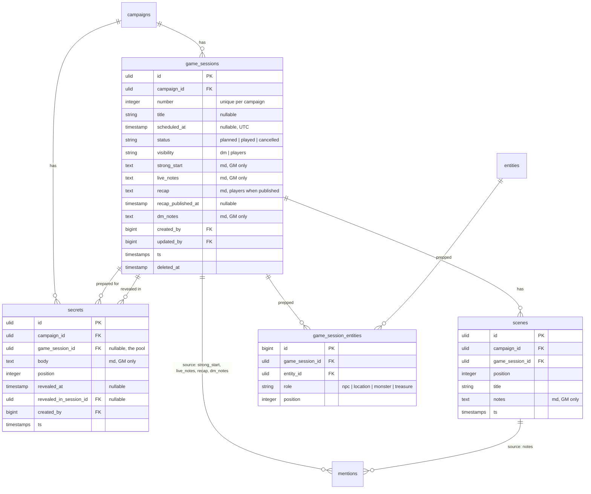

# feat: Sessions with prep, play, and recap

## Overview

This is MVP slice 2 of demgem. Slice 1 built the world: campaigns, members, entities, wiki links, visibility, search. This slice builds the loop the product is named for. A session gets a number, a title, a date, and a status. A GM preps it with a strong start, an ordered list of scenes, a set of secrets and clues, and linked NPCs, locations, monsters, and treasure. At the table the GM runs it from one screen with autosaving live notes and one-click secret reveals. Afterwards the GM writes a recap and publishes it to the party. Unrevealed secrets follow the GM into the next session.

When this slice is done, a GM can run a real game from demgem and never open a second tab. Quests with objectives, the initiative tracker, dice, and random tables come in slice 3.

## Problem Statement

Slice 1 is a wiki. Wikis already exist, and Kanka is a good one. The reason to build demgem is the claim in the brainstorm: the wiki serves the session, not the other way around. Nothing in the app today knows that a game happens on Thursday, that the GM planned six scenes, that three of ten secrets came out, or that the party never met the NPC the GM spent an hour writing. Until sessions exist, every entity is inert lore.

## Proposed Solution

Give sessions their own table and their own three screens, tuned for three different moments:

| Screen | Moment | Contents |
|---|---|---|
| Prep | The week before | Strong start, scenes, secrets and clues, prepped entities in four buckets, the party roster, a prep checklist |
| Run | At the table | Live notes with autosave, the scene list, one-click secret reveal, quick links to prepped entities |
| Show | Before and after | Number, title, date, status, and the recap. This is the only session screen a player sees. |

Sessions and scenes join the mention system as sources, so wiki links work in session prose and every entity page gains an "Appears in sessions" panel. Secrets carry forward by query, not by copying rows. The recap is gated by an explicit publish action, not by the session status, so a half-written recap never leaks.

## Technical Approach

### What slice 1 gives us for free

Check these before writing anything new. Four of them need no change at all:

| Piece | Reuse |
|---|---|
| `BelongsToCampaign` | Add the trait. `campaign_id` fills itself and the global scope applies. |
| `InteractsWithCampaign` | Add the trait to every session Livewire page. `enterCampaign()` in `mount()`. |
| `SyncMentions` | Already takes any `Model` plus an array of `field => markdown`. No change. |
| `RewriteWikiLinks` | Already walks `$mention->source` and calls `mentionableFields()` on it. Renaming an NPC rewrites session prose with no change to the action. |
| `MarkdownRenderer` + `WikiLinkRenderer::for()` | Render every session and scene field through these. |
| `EntityPolicy` / `CampaignRole::isDm()` | Same role model. Sessions add no roles. |
| `x-ui.markdown-editor` | Reuse for strong start, scene notes, live notes, recap, and GM notes. Its autocomplete URL is already campaign-scoped. |

Two need a small change:

- `AppServiceProvider::enforceMorphMap()` must gain `game_session` and `scene`. The map is enforced, so a missing entry throws at runtime.
- `Entities\Show` gains an "Appears in sessions" panel. Its existing backlinks query already filters `source_type = entity`, so session mentions cannot leak into it by accident.

### Naming trap: the `sessions` table is taken

`SESSION_DRIVER=database` and `0001_01_01_000000_create_users_table.php` already create a `sessions` table for HTTP sessions. A game session table cannot be called `sessions`.

**Decision.** Table `game_sessions`, model `App\Models\GameSession`, child tables `scenes` and `secrets`, pivot `game_session_entities`. Route segment, route names, and every word of UI copy stay "session". The class name also keeps `App\Models\Session` from shadowing the `session()` helper in files that use both.

### UI language

Slice 1 settled this and the new screens must match: the code says `dm_notes`, `isDm()`, `Visibility::Dm`. The interface says **GM**, **Co-GM**, and **GM only**. Do not write "DM" in a Blade file.

### Data model



One column joins an existing table:

- `campaigns.timezone`, string, default `UTC`. A table plays in one timezone. `scheduled_at` is stored in UTC and displayed in the campaign timezone with the zone abbreviation next to it. Per-user timezones are P2.

Notes on the model:

- **Numbers.** `unique (campaign_id, number)`. A new session takes `max(number) + 1` **including trashed rows**, so restoring a deleted session never collides. `0` is allowed, because session zero is a real thing. The GM can edit the number; validation keeps it unique per campaign.
- **Soft deletes** on `game_sessions` only. Scenes cascade with the session on force delete and ride along on soft delete. Secrets return to the pool.
- **The pivot is unique on `(game_session_id, entity_id, role)`.** A double-clicked picker or a retried request must not attach the same NPC twice. The same entity may still sit in two different buckets.
- **The pivot carries no `campaign_id`.** It is the one exception to the slice 1 rule, because both sides are already campaign-scoped and the attach path only ever picks from a campaign-scoped, visibility-filtered query. Write the reason in a comment above the migration.
- **Entities are soft-deleted.** The `entities()` relation excludes trashed rows on its own, so a deleted NPC drops out of the prep buckets and no cleanup job is needed.
- **`mentions` needs no migration.** `source` is already a `ulidMorphs`, and `source_field` at 20 characters fits `strong_start`, `live_notes`, `recap`, `dm_notes`, and `notes`.

### Enums

- `App\Enums\SessionStatus`: `Planned`, `Played`, `Cancelled`. Methods `label()`, `badgeVariant()`, `isPast()`.
- `App\Enums\PrepRole`: `Npc`, `Location`, `Monster`, `Treasure`. Methods `label()`, `plural()`, `icon()`, `description()`, `suggestedTypes(): list<EntityType>`.

`PrepRole` is a prep bucket, not an entity type. Slice 1 has no `creature` type, so a monster is whatever entity the GM drops in the Monsters bucket. `suggestedTypes()` only sorts the picker; it never restricts what the GM may attach.

Sessions reuse `App\Enums\Visibility`, restricted to two cases:

```php
'visibility' => ['required', Rule::enum(Visibility::class)->only([Visibility::Dm, Visibility::Players])],
```

`Visibility::Selected` makes no sense for a session and must be rejected by validation, not just left out of the select.

### Visibility model for sessions

Field level, not row level, with one row-level switch for drafts:

| Field | Who sees it |
|---|---|
| `number`, `title`, `scheduled_at`, `status` | Every member, when `visibility = players` |
| `recap` | Every member, when `visibility = players` **and** `recap_published_at` is set |
| `strong_start`, `live_notes`, `dm_notes`, scenes, secrets, prepped entities | GM roles only, always |

`visibility` defaults to `players`, so the schedule works with no extra clicks. A GM drafting session 13 during session 12 sets it to `dm` and the title stops spoiling. One scope enforces the row rule:

```php
// app/Models/GameSession.php
public function scopeVisibleTo(Builder $query, CampaignRole $role): Builder
{
    return $role->isDm()
        ? $query
        : $query->where($query->qualifyColumn('visibility'), Visibility::Players->value);
}
```

Surfaces that must call it: sessions index, session show, campaign dashboard cards, sidebar count, and the "Appears in sessions" panel on the entity page. `GameSessionPolicy::view()` repeats the check for direct URLs. A hidden session returns 404, never 403.

The Prep and Run routes are GM-only. A player who guesses the URL gets 404. Their GM-only fields must never enter a Livewire public property on a screen a player can mount, which is the same rule the entity form follows: the snapshot ships to the browser.

### Secrets and carry-forward

A secret belongs to the campaign. `game_session_id` records which session it is **prepared for**, and `null` means it sits in the pool. `revealed_at` plus `revealed_in_session_id` record where it came out.

The Prep screen shows three groups:

1. **This session.** `game_session_id = this`, not revealed.
2. **Carried over.** Unrevealed secrets whose `game_session_id` is another session or null, ordered oldest first. Each row has "Pull into this session", which sets `game_session_id`. Nothing is copied and nothing runs in the background: an unrevealed secret is simply still on the table.
3. **Revealed.** Collapsed, showing which session revealed each one.

Pulling a secret in appends it to the end of the target session's order, so positions stay contiguous and nothing jumps above the secrets the GM wrote today.

Reveal is available from both Prep and Run. `RevealSecret` sets `revealed_at = now()` and `revealed_in_session_id = ` the session the GM is looking at. Unreveal clears both.

**Secrets are GM-only, always.** A revealed secret is GM-facing phrasing of information the party earned in play; showing it to players in this slice would spoil more than it helps. Revealing to players is a P2 handout feature.

### Prep screen

Eight panels, in the order a GM works through them. Four read data that already exists and store nothing:

| Panel | Storage |
|---|---|
| The party | none: entities where `is_pc`, with player names |
| Strong start | `game_sessions.strong_start` |
| Scenes | `scenes` rows |
| Secrets and clues | `secrets` rows |
| Locations, NPCs, Monsters, Treasure | `game_session_entities`, one bucket per `PrepRole` |
| Prep checklist | none: computed from the panels above |

Scenes and the entity buckets both use `wire:sort` (Livewire 4) for drag-and-drop, with `wire:sort:handle` on a grip and `wire:sort:ignore` around the row buttons. The handler persists positions:

```php
// app/Livewire/Sessions/Prep.php
public function reorderScenes(string $id, int $position, ReorderScenes $reorder): void
{
    $this->authorize('update', $this->session);

    $reorder->handle($this->session, $id, $position);
}
```

Drag-and-drop is not enough on its own. Keep small up and down buttons on every row for keyboard and tablet use; they call the same action.

Scenes link entities through `[[wiki links]]` in their notes, not through a second pivot. That is the whole point of slice 1's link system and it makes scene notes searchable by the mention index.

### Run screen and autosave

The Run screen is the reason the product exists, so it gets the one piece of architecture in this slice:

**Live notes are a nested Livewire component, not a section of the Run page.** `App\Livewire\Sessions\LiveNotes` owns the textarea, the autosave, and the saved indicator. Livewire sends only a child component's own state when the child updates, and re-renders only the child. If the notes lived on the Run page, every 1.5 seconds of typing would re-render the scene list, the secret list, and the entity quick-links.

```php
// app/Livewire/Sessions/LiveNotes.php
public function updatedNotes(string $value): void
{
    $this->authorize('update', $this->session);

    $this->session->forceFill(['live_notes' => $value])->save();
    $this->savedAt = now();
}
```

```blade
<textarea wire:model.live.debounce.1500ms="notes" wire:dirty.class="ui-input--dirty"></textarea>
<span wire:dirty wire:target="notes">Saving…</span>
<span wire:dirty.remove wire:target="notes">Saved {{ $savedAt?->diffForHumans() }}</span>
```

**A nested component re-authorizes itself.** `InteractsWithCampaign::hydrateInteractsWithCampaign()` is what re-checks membership on every Livewire round trip, and it runs per component, not per page. `LiveNotes` therefore uses the trait itself and calls `enterCampaign()` in its own `mount()`. Without it, a co-GM removed mid-session keeps autosaving. For the same reason `GameSessionPolicy` must copy `EntityPolicy::roleFor()` in full, including its fallback to `$session->campaign->roleFor($user)` when `CurrentCampaign` is not set. Copy the method, not just the docblock.

Two more consequences to handle:

- **Mention churn.** Every autosave changes `live_notes`, so the observer calls `SyncMentions`, which deletes and reinserts that source's rows. Add an early return to `SyncMentions`: build the row set, compare it to the existing rows, and return before opening a transaction when they match. Typing prose then costs one select. This also speeds up entity saves.
- **Concurrent GMs.** Owner and co-GM typing at once is last-write-wins. Say so in a line of help text under the field. Real collaborative editing needs Reverb and is P2.

The rest of the Run screen is read-mostly: the scene list with notes rendered, the secret list with a Reveal button per row, and the prepped entities grouped by bucket with links that open in a new tab. An `@island` around the secret list was planned and dropped: an island cannot read the variables `render()` passes to the view, so it would force every panel onto computed properties to save a re-render that only happens on a click. The nested live-notes component already covers the case that matters, which is typing.

### Recap

`recap` is Markdown on the session. `recap_published_at` gates it. The Show screen gives GM roles the editor, a **Publish recap** button, and an **Unpublish** button. Players see the rendered recap only when the timestamp is set.

Add one button that costs nothing and saves the GM ten minutes: **Start from live notes**, enabled only when `recap` is empty, which copies `live_notes` into `recap` for the GM to edit down.

Setting the status to `played` does **not** publish anything. Publishing is always explicit.

**`Sessions\Show` is the only session screen a player mounts, so its state needs the same guard `Entities\Form` uses.** The model property is safe: Livewire dehydrates an Eloquent model to a class name and a key. A scalar is not. Populate the `$recap` editor property, and any "start from live notes" draft, inside an `if ($this->isDm())` branch in `mount()`. A player's snapshot must carry the rendered recap HTML and nothing else.

### Mentions integration

`GameSession::mentionableFields()` returns `['strong_start', 'live_notes', 'recap', 'dm_notes']`. `Scene::mentionableFields()` returns `['notes']`.

- `GameSessionObserver`: `saved` syncs mentions when any of the four fields changed; `forceDeleted` removes the source rows.
- `SceneObserver`: `saved` syncs `notes`; `deleted` removes that scene's mention rows. Scenes have no soft delete, so a removed scene must not leave rows behind.
- Soft-deleting a session leaves its mention rows alone, exactly as a soft-deleted entity does. Every read filters trashed sources.

The payoff is a panel on the entity page:

```php
// app/Actions/Sessions/SessionsMentioning.php — sessions that mention this entity
$direct = Mention::query()
    ->where('target_entity_id', $entity->id)
    ->where('source_type', 'game_session')
    ->when(! $role->isDm(), fn ($q) => $q->where('source_field', 'recap'))
    ->pluck('source_id');

// Scene notes are GM-only, so a player never reaches a session through one.
$viaScenes = collect();

if ($role->isDm()) {
    $sceneIds = Mention::query()
        ->where('target_entity_id', $entity->id)
        ->where('source_type', 'scene')
        ->pluck('source_id');

    $viaScenes = Scene::query()->whereKey($sceneIds)->pluck('game_session_id');
}

return GameSession::query()
    ->whereKey($direct->merge($viaScenes)->unique())
    ->visibleTo($role)
    ->when(! $role->isDm(), fn ($q) => $q->whereNotNull('recap_published_at'))
    ->orderByDesc('number')
    ->get();
```

Read the player branch twice before you write it. A player may only reach a session through a **published recap on a visible session**, and only through a mention whose `source_field` is `recap`. Scene notes, strong starts, live notes, and GM notes are all invisible to them, so a scene mention must not put a session in a player's list.

Sessions are mention **sources only**. `[[Session 4]]` does not resolve, because `mentions.target_entity_id` is a foreign key to `entities` and making the target polymorphic is not worth a migration in this slice.

### Routes

```php
// routes/web.php, inside the existing campaign group
Route::get('/sessions', SessionsIndex::class)->name('sessions.index');
Route::get('/sessions/create', SessionsForm::class)->name('sessions.create');
Route::get('/sessions/{number}', SessionsShow::class)->whereNumber('number')->name('sessions.show');
Route::get('/sessions/{number}/edit', SessionsForm::class)->whereNumber('number')->name('sessions.edit');
Route::get('/sessions/{number}/prep', SessionsPrep::class)->whereNumber('number')->name('sessions.prep');
Route::get('/sessions/{number}/run', SessionsRun::class)->whereNumber('number')->name('sessions.run');
```

Register these **before** the `/{type}` entity routes. The existing `Route::pattern('type', ...)` already stops `/sessions` from matching an entity type, but order makes the intent obvious to the next reader.

Resolve the session inside `mount()` the way `Entities\Show` resolves an entity, not with route model binding. `enterCampaign()` runs first and sets the global scope, so `GameSession::query()->where('number', $number)->first()` is already campaign-scoped:

```php
public function mount(Campaign $campaign, int $number): void
{
    $this->enterCampaign($campaign);

    $session = GameSession::query()->where('number', $number)->first();

    abort_if($session === null || ! $this->user()->can('view', $session), 404);

    $this->session = $session;
}
```

### UI structure

- **Sidebar.** A new "Play" group above "World", holding one "Sessions" item with a count from `GameSession::visibleTo($role)`. `SidebarComposer` gains the query.
- **Campaign dashboard.** Two cards at the top: **Next session** and **Latest recap** (most recent published recap, first 200 characters). The next-session card falls back in three steps, because a GM often preps before the group picks a date: the soonest `planned` session dated in the future; failing that, the lowest-numbered `planned` session with no date, labelled "not scheduled yet"; failing that, an empty state with a "Plan session {next number}" button.
- **Sessions index.** **Status decides the group. The date only sorts inside it.** GM view: Upcoming (`planned`), Needs recap (`played` with no published recap), Past (`played` with a recap, and `cancelled`). Player view: Upcoming (`planned` and `cancelled`), Past (every `played` session they can see, with a link when the recap is published and a quiet note when it is not; a session that happened should not vanish because the GM is slow to write). A `planned` session whose date has passed stays in Upcoming and carries an "Overdue" badge for GM roles, which is the prompt to mark it played. A text filter over number and title. No Scout in this slice.
- **Cancelled sessions stay visible.** A cancelled session keeps its row and shows a cancelled badge until its date passes, and the dashboard skips it. A player who is not told the game is off will turn up for it.
- **Session show.** Header with `Session {number}`, title, status badge, date in the campaign timezone, and GM buttons for Prep, Run, and Edit. Body is the recap or an empty state.
- **Prep and Run** as described above. Both are wide, dense, and dark-first. Run must be readable at arm's length on a tablet: minimum 16px body text, generous tap targets, and no hover-only controls.

- **Search scope.** The top-bar search stays entity-only in this slice, so its empty state must say so: "Searching characters, locations, factions, items, quests, and notes." A GM who searches for a phrase from a recap should learn why nothing came back.

Load the `frontend-design` and `ui-ux-pro-max` skills before building the Prep and Run screens, and reuse the `x-ui.*` kit from slice 1. Add at most two new kit components: `x-ui.tabs` if the session header needs them, and `x-ui.datetime-local` if the plain input proves awkward.

## Decisions resolved

| Question | Decision |
|---|---|
| Table and model name | `game_sessions` / `GameSession`. `sessions` belongs to the HTTP session driver. |
| Session as a 7th entity type | No. Too many distinct columns and three child tables. Slice 1 already anticipated child tables for relational data. |
| URL key | `/sessions/{number}`. Numbers are how GMs speak. Renumbering breaks old links, the same tradeoff slice 1 took for slugs. |
| Numbering | Auto `max(number) + 1` including trashed, editable, unique per campaign. |
| Session row visibility | `visibility` column, `dm` or `players`, default `players`. |
| Recap gate | Explicit `recap_published_at`, not the `played` status. |
| Scene to entity links | Wiki links in the notes. No second pivot. |
| Prep buckets | `game_session_entities.role` enum. Any entity type may go in any bucket. |
| Carry-forward | A query over unrevealed secrets plus a "Pull into this session" button. No copying, no job. |
| Secrets visible to players | Never in this slice, revealed or not. |
| Secrets in the mention index | No. Secrets move between sessions, so their mention rows would need re-scoping on every move. Wiki links inside them still render. |
| Live notes autosave | Nested `LiveNotes` component, `wire:model.live.debounce.1500ms`, `updated()` hook, `wire:dirty` indicator. |
| Concurrent GM edits | Last write wins, stated in the UI. Reverb is P2. |
| Session search | Not in Scout this slice. The index gets a title and number filter. Full session search is a Future Consideration with the design written down. |
| Scene "played" checkbox | Out. The Run screen tracks secrets, not scenes. P2. |
| Ordering inside a prep bucket | Insertion order, no drag. Scene order is a running order; a bucket is a shopping list. |
| `@disabled` inside a `<x-…>` tag | Never. It compiles to a stray `endif` and breaks the view. Pass `:disabled="$expr"` instead. |
| Attendance and RSVP | Out. P2 in the brainstorm. |
| In-game date range | Out. Needs the calendar, which is P2. |
| Timezone | One `campaigns.timezone` column. Per-user timezones are P2. |
| Status transitions | Every transition is legal in both directions, from the Run header and from the edit form, last write wins. A GM who marks a session played by mistake must be able to undo it, and no state machine survives contact with a table that ends early. |
| Session number floor | `min:0`, `max:9999`, integer, unique per campaign. |
| Two GMs reordering at once | Last write wins, the same as live notes. `ReorderScenes` rewrites the whole list's positions in one transaction, so the order stays contiguous whoever wins. |
| Deleting a session | Soft delete. A confirm modal always; when `recap_published_at` is set the modal names the recap and warns that the party loses it. Secrets return to the pool, scenes ride along. |
| Restoring a session | Not in this slice, as with entities. Note the asymmetry for whoever builds it: scenes come back attached, secrets do not, because `DeleteSession` releases them. |
| `[[Session 4]]` in prose | Resolves as an ordinary entity name, finds nothing, and shows the create prompt. Accepted. Suppressing the prompt would need the resolver to know about sessions, which is the polymorphic-target change this slice rejected. |

## Implementation Phases

Each phase ends with a green suite. Do not start the next phase with a red one. Generate files with `php artisan make:… --no-interaction`, and check `php artisan make:livewire --help` for the flag that produces a class plus a separate view, as slice 1 did.

### Phase 0: Postgres CI

The slice 1 plan closed with "add a Postgres CI job before slice 2". Do it first. `.github/workflows/ci.yml` runs on push and pull request: PHP 8.4, a `postgres:17` service, `composer install`, `php artisan migrate --force`, `vendor/bin/pint --test`, `composer analyse`, `php artisan test`.

Keep the local SQLite suite as it is. The point of the job is to catch what SQLite hides, which already bit this project once with `ulidMorphs`.

Success: a pull request shows three green checks.

### Phase 1: Schema and models

Deliverables:
- Migrations: `create_game_sessions_table`, `create_scenes_table`, `create_secrets_table`, `create_game_session_entities_table`, `add_timezone_to_campaigns_table`.
- Models: `app/Models/GameSession.php`, `Scene.php`, `Secret.php`. All three use `HasUlids` and `BelongsToCampaign`; `GameSession` adds `SoftDeletes`.
- Enums: `app/Enums/SessionStatus.php`, `app/Enums/PrepRole.php`.
- `GameSession::scopeVisibleTo()`, `isVisibleTo()`, `displayTitle()`, `label()`, `mentionableFields()`, `scheduledAtInCampaignTimezone()`.
- Relations: `Campaign::gameSessions()`, `GameSession::scenes()`, `secrets()`, `revealedSecrets()`, `entities()` (belongsToMany with `role` and `position` pivot), `prepped(PrepRole $role)`.
- `app/Policies/GameSessionPolicy.php`: `viewAny`, `view`, `create`, `update`, `delete`, `viewDmFields`, `publishRecap`. Scenes and secrets authorize through `update` on their session; do not add two more policies.
- Observers: `app/Observers/GameSessionObserver.php`, `SceneObserver.php`.
- `enforceMorphMap()` gains `game_session` and `scene`.
- The `SyncMentions` early return described above.
- Factories: `GameSessionFactory` with `planned()`, `played()`, `cancelled()`, `hidden()`, `withRecap()`, `published()` states; `SceneFactory`; `SecretFactory` with `revealed()` and `carriedOver()`.
- `GameSessionPolicy::roleFor()` is a copy of `EntityPolicy::roleFor()`, fallback included. `LiveNotes` and every other nested component use `InteractsWithCampaign`.

Tests: `tests/Feature/Sessions/SessionModelTest.php` (visibility scope, display title, timezone accessor), `tests/Feature/Mentions/SessionMentionsTest.php` (session and scene sources sync, rename rewrites session prose, soft delete keeps rows, `SyncMentions` skips a no-op write).

Success: `composer analyse` clean, and renaming an entity rewrites a link inside a session's strong start.

### Phase 2: Session CRUD and the two lists

Deliverables:
- Actions: `app/Actions/Sessions/CreateSession.php`, `UpdateSession.php`, `DeleteSession.php` (release secrets to the pool).
- `CreateSession` numbers inside a transaction and retries once on a unique violation. A second failure rethrows; the form catches it, keeps the input, and flashes "Could not pick a session number. Try again." Do not swallow it silently.
- Validation on the form: `number` is `integer`, `min:0`, `max:9999`, and unique per campaign ignoring the current row; `visibility` uses `Rule::enum(...)->only([Dm, Players])`; `title` is `nullable, max:120`; `scheduled_at` is `nullable, date`.
- Livewire: `app/Livewire/Sessions/Index.php`, `Show.php`, `Form.php` with views under `resources/views/livewire/sessions/`.
- Routes, sidebar "Play" group and count, dashboard cards.
- Campaign settings gains the timezone select. `resources/views/livewire/campaigns/settings.blade.php` and `Settings.php`.
- Empty states for both lists.

Tests: `CreateSessionTest`, `UpdateSessionTest`, `DeleteSessionTest` (confirm required, secrets released), `SessionNumberingTest` (auto number, trashed numbers stay taken, duplicate rejected, negative rejected), `SessionVisibilityTest` (hidden session 404s for a player and is absent from index, sidebar count, and dashboard), `SessionIndexTest` (grouping by status, an overdue planned session, a cancelled session on a player's index, filter), `tests/Feature/Campaigns/CampaignTimezoneTest.php`, `tests/Feature/Tenancy/SessionIsolationTest.php`.

Success: a GM schedules session 1, a player sees the date on the dashboard, and a hidden session is invisible to that player on every surface.

### Phase 3: Prep screen

Deliverables:
- `app/Livewire/Sessions/Prep.php` and its view: strong start editor, scenes, secrets, four entity buckets, party roster, prep checklist.
- `app/Actions/Sessions/ReorderScenes.php`. Buckets keep insertion order and are not sortable: a bucket holds a handful of rows and their order carries no meaning, unlike a scene list. Revisit if a GM asks.
- Scene add, inline edit, and remove inside the component.
- Entity picker per bucket: reuses the existing autocomplete route, filtered by `visibleTo()`, with the bucket's `suggestedTypes()` first.
- `wire:sort` with a visible grip, plus up and down buttons.

Tests: `ScenesTest` (add, edit, remove, GM only), `ReorderScenesTest` (drag handler and buttons produce the same order, positions stay contiguous), `PrepEntitiesTest` (attach, detach, one entity in two buckets, a trashed entity disappears, a player gets 404 on the screen), `PrepChecklistTest`.

Success: a GM builds a full Lazy-GM prep in one screen with no page reload.

### Phase 4: Secrets and carry-forward

Deliverables:
- Secret add, edit, remove inside the Prep component.
- `app/Actions/Sessions/RevealSecret.php` and `CarrySecretForward.php`.
- The three groups, the "Pull into this session" button, and the revealed list with its source session.
- Secret bodies render through `MarkdownRenderer` with wiki links, inline only.

Tests: `SecretsTest` (CRUD, GM only, never in a player's HTML), `RevealSecretTest` (records the session, unreveal clears both columns), `CarryForwardSecretsTest` (unrevealed secrets from session 1 appear on session 2, revealed ones do not, pulling reassigns and appends to the end, deleting a session returns its secrets to the pool).

Success: a GM ends session 1 with four of ten secrets revealed, opens session 2, and sees exactly six waiting.

### Phase 5: Run screen

Deliverables:
- `app/Livewire/Sessions/Run.php` and its view: scene list rendered, secrets island with reveal, prepped entities grouped, and the live notes child.
- `app/Livewire/Sessions/LiveNotes.php` and its view.
- Status control on the header: start (`planned` to `played`) and cancel.
- Tablet pass at 1024px and 768px, dark and light.

Tests: `LiveNotesAutosaveTest` (a property update persists, a player 404s on the route, notes never appear in a player's session HTML), `RunScreenTest` (reveal from Run records this session, N+1 free under strict mode).

Success: a GM runs a whole session from one screen, and the notes survive a browser refresh mid-sentence.

### Phase 6: Recap and the entity panel

Deliverables:
- Recap editor, **Publish recap**, **Unpublish**, and **Start from live notes** on `Sessions\Show`.
- `app/Actions/Sessions/SessionsMentioning.php` and the "Appears in sessions" panel on `Entities\Show`. It lives beside the other session actions rather than in a new `app/Queries` folder, because CLAUDE.md asks for approval before a new base directory.
- Player recap view and the recap archive on the sessions index.

Tests: `RecapTest` (unpublished recap invisible to players, published visible, status change does not publish, seeding from live notes only when empty, no recap editor state in a player's snapshot), `EntitySessionPanelTest` (GM sees sessions matched through scene notes and GM notes, a player sees only sessions matched through a published recap on a visible session).

Success: the party reads Thursday's recap on the entity page of the NPC they met.

### Phase 7: Polish

- Empty states for every new list. Flash messages on every action.
- Keyboard: `n` opens a new session on the sessions index, matching slice 1's entity index.
- `README.md` gains the session loop in the feature list and `CAMPAIGN_TIMEZONE` guidance in the settings notes.
- Run `vendor/bin/pint --dirty --format agent`, `composer analyse`, and the full suite. Fix everything.

## Alternative Approaches Considered

- **Sessions as a 7th entity type.** Free wiki links, free search, free visibility. Rejected: eight session-specific columns and three child tables would sit unused on every other row, and the entity form would grow a large conditional branch.
- **Copying unrevealed secrets into the next session.** Matches how a GM thinks about carrying a note forward. Rejected: it duplicates rows, breaks the reveal history, and needs a "which session created this" column to undo. A query says the same thing with no writes.
- **Publishing the recap when the status becomes `played`.** One less control. Rejected: the GM sets the status at the table, hours before the recap is written, so the party would read a blank or half-written recap.
- **A `session_scene_entities` pivot for scene links.** Explicit and queryable. Rejected: slice 1 already parses `[[links]]` into `mentions` on save, and a second mechanism would drift from the first.
- **Making mentions polymorphic on the target so `[[Session 4]]` resolves.** Rejected in this slice. It is a migration plus resolver, priority, and autocomplete changes, for a link GMs rarely write.
- **Live notes in an Alpine-only local draft with a manual save.** Fewer requests. Rejected: a closed tab loses the table's notes, which is the one thing this screen must never do.
- **Reverb for shared live notes.** The real answer to two GMs typing. Deferred to P2 with the rest of the real-time work, as the brainstorm plans.

## Acceptance Criteria

### Functional

- [ ] A GM creates a session; it takes the next number automatically and the GM can override it.
- [ ] Number, title, date, status, and visibility are editable, and duplicate numbers are rejected.
- [ ] `scheduled_at` shows in the campaign timezone, with the zone shown next to it, on every surface.
- [ ] The sessions index groups by status: Upcoming, Needs recap, and Past for a GM, and Upcoming and Past for a player.
- [ ] A cancelled session stays on a player's index with a cancelled badge until its date passes.
- [ ] An overdue `planned` session stays in Upcoming and shows an overdue badge to GM roles.
- [ ] A session with `visibility = dm` is absent from a player's index, dashboard, sidebar count, and entity panels, and its URL 404s.
- [ ] The Prep screen holds a strong start, ordered scenes, secrets, and four entity buckets, and reports which steps are done.
- [ ] Scenes reorder by drag and by button, and positions stay contiguous after a delete.
- [ ] An entity attaches to any bucket, appears there with its image and type, and disappears when it is deleted.
- [ ] Unrevealed secrets from earlier sessions appear on the next session's prep as "Carried over" and can be pulled in.
- [ ] Revealing a secret records the session it came out in; unrevealing clears it.
- [ ] Live notes autosave while typing, show a saving and a saved state, and survive a refresh.
- [ ] The recap publishes and unpublishes explicitly, and players see it only when it is published.
- [ ] "Start from live notes" fills an empty recap and is unavailable once the recap has content.
- [ ] Wiki links work in strong start, scene notes, live notes, recap, GM notes, and secret bodies.
- [ ] Renaming an entity rewrites its links inside session and scene prose.
- [ ] Every entity page lists the sessions that mention it, filtered by what the viewer may see.
- [ ] A member of campaign A gets 404 on a session URL in campaign B.

### Non-functional

- [ ] No GM-only field of any session reaches a player's HTML, Livewire snapshot, or JSON. The recap editor state exists only for GM roles, checked by reading the snapshot in a test.
- [ ] A member removed or demoted mid-session stops writing on the next Livewire request, including from the nested live-notes component.
- [ ] `Model::shouldBeStrict()` is on, so Prep, Run, and both lists eager-load and no test throws a lazy-load exception.
- [ ] Autosave with unchanged wiki links performs no mention writes.
- [ ] Prep and Run are usable at 1024px and 768px in dark and light themes, with 16px body text and no hover-only controls.
- [ ] Markdown in session fields is rendered by the slice 1 renderer, so raw HTML is stripped and `javascript:` links are blocked.

### Quality gates

- [ ] Pest suite green on SQLite locally and on Postgres in CI.
- [ ] Larastan level 6 clean. Pint clean.
- [ ] Every new query on `game_sessions` calls `visibleTo()`, and the policy docblock lists the surfaces, as `EntityPolicy` does.

## Dependencies & Risks

| Risk | Mitigation |
|---|---|
| The `sessions` table name collides with the HTTP session driver | Decided up front: `game_sessions` and `GameSession`. Phase 1 migration names make it impossible to get wrong later. |
| `enforceMorphMap()` throws for unmapped models | Add `game_session` and `scene` in the same commit as the models. A mention test catches a miss immediately. |
| Autosave floods the database with mention rewrites | Nested `LiveNotes` component plus the `SyncMentions` early return. Assert the write count in a test. |
| A soft-deleted session holds its number forever | Auto-numbering counts trashed rows, and a test asserts it. |
| `wire:sort` is new in Livewire 4 and may not behave as documented | Read the 4.x `wire:sort` page when Phase 3 starts. Buttons ship in the same phase, so the feature works even if drag-and-drop is dropped. |
| Player leak through the new "Appears in sessions" panel | The single hardest visibility rule in the slice. It gets its own test file, and the query lives in one class that every caller uses. |
| Two GMs typing live notes overwrite each other | Documented in the UI. Reverb in P2. |
| Prep and Run grow into slow pages | Eager-load every relation; strict mode makes a miss fail in tests. Islands isolate the secret list. |
| A player's open tab keeps showing content the GM just hid | Accepted for a slice with no websockets. Unpublishing a recap, hiding a session, or unrevealing a secret takes effect on the player's next request. Say it in the plan, not in the UI, and let Reverb fix it in P2. |
| Timezone handling is wrong for a GM who travels | Out of scope by decision: the campaign has one timezone. Per-user timezones are P2. |

## Future Considerations

- **Session search.** Add Scout to `GameSession` with `toSearchableArray()` returning `title` and `recap` only, then merge two result sets on the search page with a type badge per hit. GM-only fields must stay out of the index, which means a GM searching their own live notes needs a separate database-side query.
- P2 from the brainstorm that builds directly on this slice: RSVP and attendance (`session_attendance`), reminder emails and an iCal feed from `scheduled_at`, an XP or milestone log per session, in-game date range once the calendar exists, and a Discord webhook that posts a published recap.
- Slice 3: quests with objectives, the initiative tracker, dice, and random tables. An encounter will reference `game_session_id`, so keep the column nullable when it arrives.
- P2 real-time: Reverb for shared live notes, a player-visible dice log, and the tracker.
- Scene "played" checkboxes, progress clocks, and handouts with reveal all belong to the Run screen and should land together.

## References

### Internal

- Brainstorm: `docs/brainstorms/2026-09-02-demgem-campaign-manager-brainstorm.md`, sections "Session loop" and "Data model sketch"
- Slice 1 plan: `docs/plans/2026-09-02-feat-campaigns-members-entities-foundation-plan.md`
- Reused without change: `app/Actions/Mentions/SyncMentions.php`, `RewriteWikiLinks.php`, `app/Markdown/MarkdownRenderer.php`, `app/Livewire/Concerns/InteractsWithCampaign.php`, `app/Models/Concerns/BelongsToCampaign.php`
- Patterns to copy: `app/Livewire/Entities/Form.php` (validation and the rule about GM fields in the snapshot), `app/Livewire/Entities/Show.php` (resolve in mount, render with a viewer-bound renderer), `app/Policies/EntityPolicy.php` (the surface checklist docblock)
- Morph map: `app/Providers/AppServiceProvider.php:25`
- HTTP session table that forces the rename: `database/migrations/0001_01_01_000000_create_users_table.php:30`

### External

- Livewire 4 `wire:sort`: https://livewire.laravel.com/docs/4.x/wire-sort
- Livewire 4 real-time form saving and the `updated()` hook: https://livewire.laravel.com/docs/4.x/forms
- Livewire 4 `wire:dirty`: https://livewire.laravel.com/docs/4.x/wire-dirty
- Livewire 4 islands and when to prefer a nested component: https://livewire.laravel.com/docs/4.x/nesting
- Livewire 4 nesting and independent child updates: https://livewire.laravel.com/docs/4.x/understanding-nesting
- Laravel 13 enum validation with `only()`: https://laravel.com/docs/13.x/validation#rule-enum
- Laravel 13 soft deletes: https://laravel.com/docs/13.x/eloquent#soft-deleting
- The Lazy Dungeon Master prep steps, as a method reference only: https://slyflourish.com/lazy_dm_prep.html
