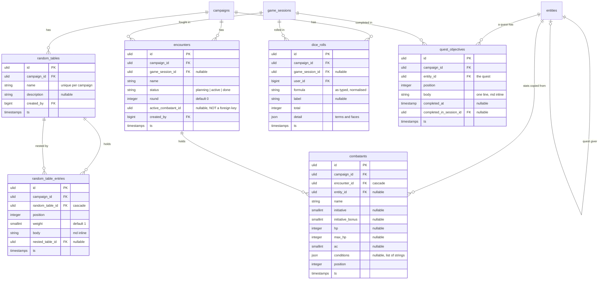

# feat: Quests, the initiative tracker, dice, and random tables

## Overview

This is MVP slice 3 of demgem, and it closes roadmap items 4 and 5. Slice 1 built the world. Slice 2 built the loop. This slice puts the tools a GM reaches for *during* the four hours the loop exists to serve, and gives the party the one thing they always ask for between games: what are we actually doing, and how far along are we.

Four features:

| Feature | What it adds |
|---|---|
| Quests with objectives | A status, a giver, rewards, and an ordered checklist on the quest entity. Ticking an objective records the session it happened in. |
| Initiative tracker | Encounters with combatants, initiative order, HP, AC, conditions, rounds, and a turn marker that survives a refresh. |
| Dice roller | A formula parser with keep-highest and keep-lowest, an advantage toggle, individual die faces, and a persisted log. |
| Random tables | Weighted entries, nested tables, and one-click rolling from the Run screen. |

When this slice is done, a GM can run a combat, roll for it, generate the tavern rumour that starts the next scene, and tick off the objective the party just finished, without leaving the Run screen. The player campaign view, JSON export, and Docker Compose finish the MVP after this.

**On scope.** This is the widest slice of the three, and it is four features rather than one. The phases below are ordered so that Phases 1 and 2 (quests) ship as a release on their own, and Phases 3 to 5 (the table tools) ship as a second one. If the slice runs long, cut at the end of Phase 2 and release. Do not cut a phase in half.

## Problem Statement

Slice 2 made the app worth opening on a Thursday night. It is not yet worth keeping open. The moment the party rolls initiative the GM alt-tabs to Improved Initiative, and the moment they need a d20 they pick up a physical die, and neither of those is a loss. The loss is that demgem learns nothing from either. The app that knows the GM prepped six scenes and revealed three secrets does not know the party fought the cultists, that the fight took five rounds, or that the fighter is at 3 HP going into the next scene.

Quests are worse than absent: they are present and inert. Slice 1 shipped `quest` as an entity type with a name, a body, and nothing that distinguishes a quest from a note. A quest is the one entity with a shape — it is available, or active, or done, and it is made of steps that get finished one at a time. Today a GM tracks that in a Markdown checklist in the body, which nothing can count, sort, or show to a player.

## Proposed Solution

Give quests the two things that make them quests, and give the table its three tools.

**Quests stay entities.** Slice 1 rejected a table per type and said the exception would be a child table for relational data, naming quest objectives as the example. That is exactly what this does: `quest_objectives` hangs off the entity, and three nullable columns join `entities` beside the `is_pc` and `player_user_id` columns that are already character-only. Quests keep wiki links, backlinks, visibility, tags, nesting, images, and search for free.

**The table tools are GM-only and session-aware.** Encounters, dice rolls, and random tables all carry a nullable `game_session_id`, so an encounter fought in session 7 and a d20 rolled at that table both know where they happened. None of the three is visible to a player in this slice, because every player-facing version of them (the shared dice log, the player tracker view) needs Reverb, which is P2. The columns are shaped for that arrival; the screens are not built for it.

**The Run screen grows in two directions, not one.** The tracker goes into the main column, because when combat is happening combat is the main event. Dice and tables go into a drawer, because a GM opens them for four seconds and closes them.

## Technical Approach

### What slices 1 and 2 give us for free

Check these before writing anything new:

| Piece | Reuse |
|---|---|
| `BelongsToCampaign` | Add to every new model. `campaign_id` fills itself and the global scope applies. |
| `InteractsWithCampaign` | Add to every new Livewire page **and every nested component**. `enterCampaign()` in each own `mount()`. |
| `SyncMentions` / `RewriteWikiLinks` | Adding `rewards` to `Entity::mentionableFields()` is the whole integration. Both actions already walk that list. |
| `MarkdownRenderer` + `WikiLinkRenderer::for()` | Render rewards, objectives, and random table entries through these. |
| `EntityPolicy` | Quests are entities, so `view`, `update`, and `visibleTo()` already work. One new ability joins it. |
| `GameSessionPolicy::roleFor()` | Copy it into the two new policies, fallback included. It is what stops a removed co-GM from writing. |
| `x-ui.markdown-editor` | Reuse for rewards. Its autocomplete URL is already campaign-scoped. |
| `Entities\Index` filters | The quest status filter is a fourth `#[Url]` property beside `search`, `tag`, and `visibility`. |
| `SessionStatus` / `PrepRole` | The pattern for the three new enums: `label()`, `description()`, `badgeVariant()`, `icon()`. |
| `DemoCampaignSeeder` | Extend it. A demo campaign with no quest, no encounter, and no table undersells three of four features. |

Two need a change, and one needs a refactor:

- **`Entity::mentionableFields()`** gains `rewards`, and `Entity::toSearchableArray()` gains it too.
- **`app/Livewire/Entities/Show.php:63`** filters backlinks to `source_field = 'body'` for players. `rewards` is player-visible, so that becomes `whereIn('source_field', ['body', 'rewards'])`. This is the only place in the app that filters `source_field` for entity sources; `grep -rn source_field app/` confirms it.
- **`ReorderScenes`** gets generalised. Slice 3 needs the identical rewrite-every-position logic for objectives, combatants, and table entries. Four copies of it is three too many.

### The reorder refactor, first

```php
// app/Actions/Support/ReorderPositions.php
/**
 * Moves one row to a zero-based position and rewrites every position in the list.
 * Rewriting the lot keeps them contiguous whichever GM wins a simultaneous drag.
 *
 * @template TModel of \Illuminate\Database\Eloquent\Model
 * @param  \Illuminate\Database\Eloquent\Builder<TModel>  $ordered  Already sorted by position.
 */
public function handle(Builder $ordered, string $id, int $position): void
{
    DB::transaction(function () use ($ordered, $id, $position): void {
        $ids = $ordered->pluck($ordered->getModel()->getKeyName())->all();
        $from = array_search($id, $ids, true);

        if ($from === false) {
            return;
        }

        array_splice($ids, $from, 1);
        array_splice($ids, max(0, min($position, count($ids))), 0, [$id]);

        foreach ($ids as $index => $rowId) {
            $ordered->getModel()->newQuery()->whereKey($rowId)->update(['position' => $index]);
        }
    });
}
```

`ReorderScenes` keeps its class and its two-method surface and delegates both to this. `ReorderScenesTest` must pass untouched; if it needs an edit, the refactor changed behaviour and is wrong. Every new reorder handler follows the same two-path rule slice 2 set: drag-and-drop through `wire:sort`, plus up and down buttons that call the same action, for keyboard and tablet.

### Data model



Three columns join `entities`:

- `quest_status`, string 20, **nullable, no default**. Only quest rows carry a value. A default would write `available` onto every character.
- `giver_entity_id`, nullable ULID, `constrained('entities')->nullOnDelete()`. Beside the existing `parent_id` self-reference.
- `rewards`, nullable text. Markdown, rendered separately from the body.

Plus `index (campaign_id, quest_status)`.

### Notes on the model

- **Slice 1's own precedent carries the three columns.** `entities.is_pc` and `entities.player_user_id` are already character-only and null on every other row. Three quest-only columns are the same trade, made for the same reason: one table keeps links, search, visibility, and tags in one place.
- **Backfill the existing quests.** The migration sets `quest_status = 'available'` where `type = 'quest'`, in the same file that adds the column. `Entity::questStatus()` still coalesces a null to `QuestStatus::Available` for a quest, because a row created by a factory or a raw insert may miss it. Belt and braces; the accessor is one line.
- **`encounters.active_combatant_id` is a plain ULID with an index and no foreign key.** A constraint here would be circular: `combatants.encounter_id` points at `encounters`, so `encounters.active_combatant_id` pointing back at `combatants` gives two tables that cannot be created in either order without a deferred constraint. `RemoveCombatant` clears the column when it deletes the active row, and `NextTurn` treats an id that no longer resolves as "start from the top". Write the reason in a comment above the migration, and record it as a rule.
- **Encounters hard-delete and cascade their combatants.** Every other object in the app soft-deletes. An encounter is the one thing in demgem with no life after the fight: nothing links to it, no player sees it, and there is no restore UI to reach it from. The confirm modal names the combatant count.
- **`random_tables` hard-delete too**, for the sharper reason that `random_table_entries.nested_table_id` is a real foreign key with `nullOnDelete`. Soft deletes would leave a nesting entry pointing at a trashed table and force every roll to handle a fourth outcome. A hard delete degrades that entry to plain text, which is correct and needs no code.
- **`game_session_id` on all three tools uses `nullOnDelete`, which never fires**, because `game_sessions` soft-deletes. That is deliberate and matches `secrets.revealed_in_session_id` from slice 2: an encounter keeps its session link through a soft delete, and every read filters trashed sessions.
- **`combatants.entity_id` uses `nullOnDelete`, which also never fires**, because entities soft-delete. It does not matter: `name`, `hp`, `max_hp`, and `ac` are copied onto the combatant when it is added, so a combatant whose NPC was deleted mid-campaign still renders completely. The `entity()` relation excludes trashed rows on its own and the link degrades to a plain name.
- **`combatants.hp` is a signed integer.** Damage clamps at 0, but a signed column costs nothing and leaves room for the systems that track negatives when the ruleset module lands.
- **`random_tables` is unique on `(campaign_id, name)`.** A GM says "roll the rumour table" and means one table.
- **`random_tables.campaign_id` is NOT nullable in this slice.** The brainstorm sketch has it nullable for global built-in tables, and the built-in generators are P2. A nullable `campaign_id` would be silently filtered out by `BelongsToCampaign`'s global scope, so shipping the column before the feature ships a trap. Add it with the generators, and change the scope in the same commit.

### Enums

- `App\Enums\QuestStatus`: `Available`, `Active`, `Completed`, `Failed`. Methods `label()`, `description()`, `badgeVariant()`, `icon()`, `isOpen()`.
- `App\Enums\EncounterStatus`: `Planning`, `Active`, `Done`. Same four methods.
- **Conditions are free text, not an enum.** The brainstorm calls the tracker "system-light. Works for any game", and a fixed condition list is a ruleset decision. The UI offers an HTML `<datalist>` of the dozen common ones and accepts anything up to 40 characters. The 5e list arrives with the compendium in P2.

### Quest visibility, and the two leaks in it

Objectives, rewards, and status are all **player-visible when the quest is**. There is no field-level split here, which is the right default: a quest a player can see is a quest they should be able to read. Two things on the page are not the quest, though, and both leak if they are rendered plainly.

**The giver is another entity, and it has its own visibility.** A quest the party can read may be given by an NPC they have not met. `Entities\Show` already solves this for the parent chain — `ancestors()` is filtered through `isVisibleTo()` before it reaches the view. The giver takes the same treatment:

```php
'giver' => $this->entity->giver !== null && $this->entity->giver->isVisibleTo($user, $role)
    ? $this->entity->giver
    : null,
```

A hidden giver renders as nothing, not as a greyed-out name and not as "hidden". The absence of a row is the only safe empty state.

**An objective's completing session has its own visibility too.** "Finished in Session 7" is a fine thing to show a player, unless session 7 is a `visibility = dm` draft. Eager-load `completedInSession` and pass it through `GameSession::visibleTo($role)` before rendering the badge. Both of these get a test.

The quest status filter on the index needs no special handling: it composes onto `Entity::visibleTo()`, which already runs first.

### Objectives are not mention sources

Objectives render their wiki links, so a GM can jump from "Fetch the [[Sunblade]]" to the item mid-session. They are **not** indexed in `mentions`.

The reason is not the one secrets had. It is that `mentions.source_id` would hold an objective id, and the backlinks query on `Entities\Show` resolves source ids straight to entities with `whereIn('id', $backlinkSourceIds)`. An objective source needs a second hop — objective id, then quest id, then that quest's visibility — inside the hardest security query in the codebase, the one `SessionsMentioning` already needed a careful two-branch rewrite to get right. The payoff is a backlink a GM can already get by naming the item in the quest body.

`rewards` **is** indexed, because it lives on the entity itself and needs no hop at all. That is where the wiki-link payoff goes.

### The dice formula

One grammar, no aliases:

```
formula := term (('+' | '-') term)*
term    := dice | integer
dice    := [count] 'd' sides [keep]
keep    := ('kh' | 'kl') [n]
```

- `count` defaults to 1. `keep` count defaults to 1.
- Case-insensitive. Whitespace ignored. `2d6+3`, `d20`, `4d6kh3`, `2d20kl1`, `1d8+1d6+2` all parse.
- **Limits, enforced in the parser, not the UI**: `sides` in 2 to 1000, `count` in 1 to 100, at most 10 terms, at most 100 dice in the whole formula. `999d999` is rejected with a message, not rolled.
- **There is no `adv` keyword.** The advantage toggle rewrites a leading `d20` term into `2d20kh1` before parsing, and disadvantage into `2d20kl1`. Two syntaxes for one roll is the thing to avoid.

```
app/Support/Dice/DiceFormula.php   parse() and a list of immutable terms
app/Support/Dice/DiceTerm.php      one term: count, sides, keep mode, keep count, sign
app/Support/Dice/DiceRoll.php      the result: total, and per-term faces plus which were kept
app/Support/Dice/DiceRoller.php    rolls a DiceFormula, takes a Randomizer
app/Exceptions/InvalidDiceFormulaException.php
```

It goes under `app/Support/`, which exists, rather than a new `app/Dice/`. CLAUDE.md asks for approval before a new base folder, and slice 2 took the same detour when it put a query class in `app/Actions/Sessions/` instead of opening `app/Queries/`.

**Randomness is injected so tests are deterministic.** `DiceRoller` takes `Random\Randomizer` through constructor promotion. Production resolves the container default. A test binds a seeded engine:

```php
$this->app->instance(Randomizer::class, new Randomizer(new Mt19937(1234)));
```

Assert exact totals for the seeded cases, and assert ranges plus kept-die counts for the property-style ones.

### The initiative tracker

**`position` is the authoritative turn order. `initiative` is a number the GM writes down.** Sorting by initiative descending with position as a tiebreak sounds simpler and is worse: a drag then only means something inside a tie, which no GM will predict. Instead, **Sort by initiative** is a button that rewrites every position from the current initiative values, and after that the GM drags freely.

That button, and every other list order in this slice, must not sort nulls by accident:

```php
// Portable across SQLite and Postgres. "nulls last" is not.
->orderByRaw('case when initiative is null then 1 else 0 end')
->orderByDesc('initiative')
```

This project has already lost time to a Postgres-only behaviour that SQLite hid. The CI job from slice 2 Phase 0 exists to catch the next one, but write the portable form first.

Actions, all under `app/Actions/Encounters/`:

| Action | Behaviour |
|---|---|
| `CreateEncounter` | Name required. `game_session_id` set when it is started from the Run screen, null otherwise. |
| `AddCombatants` | Takes an `Entity` or a bare name, plus a quantity of 1 to 20, plus optional HP and AC applied to every copy. Quantity above 1 names them `Goblin 1` … `Goblin 4`. Copies `name` from the entity; there are no stat blocks until P2. |
| `RollInitiative` | Fills `initiative` with `d20 + initiative_bonus` for every combatant that is not a PC. A combatant is a PC when its linked entity has `is_pc`. Writes no `dice_rolls` rows — twelve log lines for one button is noise. |
| `SortByInitiative` | Rewrites positions from initiative, nulls last, through `ReorderPositions`. |
| `NextTurn` | Advances `active_combatant_id` by position. A wrap increments `round`. A first call sets `status = active` and `round = 1`. An `active_combatant_id` that no longer resolves starts from the top. |
| `ApplyDamage` | One signed amount; negative heals. Clamps at 0 and at `max_hp` when `max_hp` is set. Death saves and negative HP are P2. |
| `SetConditions` | Replaces the list. At most 12 entries, each at most 40 characters. |
| `RemoveCombatant` | Deletes the row and clears `active_combatant_id` when it pointed at that row. |
| `DeleteEncounter` | Hard delete inside a transaction. Combatants cascade. |

Status transitions are legal in both directions from the tracker header, exactly as slice 2 decided for session status. A GM who ends a fight by mistake must be able to un-end it, and no state machine survives contact with a table.

### The tracker polls, and what that costs

`App\Livewire\Encounters\Tracker` is a **nested component** with `wire:poll.visible.15s`. Two GM devices at one table is the ordinary case — a laptop for notes and a tablet propped against the screen — and the tracker is the one panel where a stale round number actively misleads.

Three rules make the poll safe rather than annoying:

1. **Every edit is an explicit action.** No `wire:model.live` anywhere in the tracker. The damage field binds with `.blur` and submits on Enter. A poll cannot clobber a value the GM is still typing when nothing is live-bound to a keystroke.
2. **`.visible` and 15 seconds.** A backgrounded tab and a scrolled-away panel stop polling. Slice 2's autosave already set the precedent that the interval is a decision, not a default.
3. **One query per poll.** Combatants with `entity` eager-loaded, and nothing else. Assert the count in a test.

The residual risk is a poll landing between a GM's two clicks and morphing a row under the cursor. It is small, it is recoverable, and the real fix is Reverb in P2. Say so in this plan and not in the UI.

**A nested component re-authorises itself.** `InteractsWithCampaign::hydrateInteractsWithCampaign()` runs per component, not per page, so `Tracker`, `Dice\Tray`, `RandomTables\Roller`, and `Quests\Objectives` each use the trait and each call `enterCampaign()` in their own `mount()`. `EncounterPolicy` and `RandomTablePolicy` each copy `GameSessionPolicy::roleFor()` in full, fallback included. Copy the method, not the docblock. This is the recorded rule in `.ai/rules/livewire.md`, and a polling component makes it sharper: without it a removed co-GM keeps pulling the encounter every 15 seconds.

### Random tables

**Weights only. No dice ranges.** Published tables are written as ranges (01–05, 06–10), and weights say the same thing better: a weight of 5 in a total of 100 *is* rows 01 to 05. The screen shows the derived range beside every row, so a GM transcribing a d100 table watches it line up as they type, and the table's roll is always `d{sum of weights}`. The brainstorm's `random_tables.dice` column is therefore not built — it would be a second source of truth for a number already implied.

```php
// app/Actions/RandomTables/RollRandomTable.php
/**
 * @param  list<string>  $visited  Table ids already rolled in this chain.
 * @return list<array{table: RandomTable, entry: RandomTableEntry|null, note: string|null}>
 */
public function handle(RandomTable $table, array $visited = []): array
```

- Sum the weights. No entries, or a total of 0, returns one result with `entry: null` and a note.
- Pick with the injected `Randomizer`, then walk entries in position order accumulating weight.
- An entry with `nested_table_id` recurses.
- **Depth stops at 5.** Deeper returns the chain so far with a truncation note.
- **A cycle stops at the repeat.** `$visited` catches A → B → A and returns a note naming the loop.
- Validation rejects setting `nested_table_id` to the table's own id at write time. That kills self-nesting, which is the mistake a GM actually makes; the longer loops are only catchable at roll time, which is why the guard exists in both places.

**Table rolls are not persisted.** `dice_rolls` holds dice, and a table result is prose the GM either uses or discards. The component keeps the last 10 in its own state, and a GM who wants to keep one pastes it into live notes. Persisting them would need a second log surface and a second visibility rule for a row nobody has asked to keep.

### Screens and routes

```php
// routes/web.php, inside the existing campaign group, beside the session routes
Route::get('/encounters', EncountersIndex::class)->name('encounters.index');
Route::get('/encounters/{encounter}', EncountersShow::class)->name('encounters.show');
Route::get('/tables', RandomTablesIndex::class)->name('tables.index');
Route::get('/tables/{table}', RandomTablesShow::class)->name('tables.show');
```

`Route::pattern('type', ...)` already stops these from matching an entity type, but register them above the `/{type}` block anyway, as slice 2 did, so the intent is obvious.

**Resolve in `mount()`, not with route model binding.** `{encounter}` and `{table}` are ULID strings that the component looks up after `enterCampaign()` has set the global scope. Route binding runs before the component mounts, so it would resolve outside the campaign scope and lean on `scopeBindings()` to save it. Slice 2 settled this for `/sessions/{number}` and the reasoning is identical:

```php
$encounter = Encounter::query()->whereKey($id)->first();

abort_if($encounter === null || ! $this->user()->can('view', $encounter), 404);
```

**ULIDs in the URL, deliberately.** Sessions earned `/sessions/4` because a number is how GMs speak. An encounter and a table are GM tools, not shared lore: nothing links to them, no player opens them, and neither is worth the slug machinery or the rename-breaks-links trade. `GenerateSlug` is hard-coded to `Entity` and stays that way.

Surfaces, in the order a GM meets them:

- **Sidebar.** The "Play" group gains **Encounters** and **Tables**, both GM-only, with counts from `SidebarComposer`. The composer already runs its queries inside one `if`; add both there and skip them for a player rather than filtering after the fact.
- **Campaign dashboard.** A third card: **Quests in play**. Active quests, visible to the viewer, with an objective count like "3 of 7". Player-visible, and the first thing a player will look at.
- **Quest index.** `/quests` gains a status filter chip row beside the existing tag and visibility filters, and each row shows its status badge and objective progress. This is the player's quest log, and it needs no new route to be one. The status filter is a `#[Url]` property so a filtered log is a shareable link.
- **Quest page.** Three additions to `Entities\Show`, and only for `type = quest`: a status badge in the header, a giver row (filtered), and the objectives panel. Rewards render as their own block below the body.
- **Objectives panel.** `App\Livewire\Quests\Objectives`, nested. Add, edit, remove, reorder, tick. Read-only for a player, with a checkbox that is present and disabled rather than absent, so the party can see what is done. Pass `:disabled="true"`, never `@disabled(...)` — inside an `x-ui.*` tag that compiles to a stray `endif` and kills the view, which is the recorded rule in `.ai/rules/views.md`.
- **Encounters index.** Active encounters first, then planning, then done, newest first inside each group. A "New encounter" button. Empty state.
- **Encounter page.** The `Tracker` component full-width, plus the tools drawer.
- **Tables index and table page.** Entry CRUD with weight, derived range, drag order, and a nested-table select. A large Roll button and the last 10 results.
- **Run screen, main column.** The tracker sits above live notes when the session has an encounter, and collapses to a single "Start an encounter" control when it does not. Combat is the main event when combat is happening, and the aside is already full.
- **Run screen, active quests.** A panel below the tracker holding up to 10 `active` quests with tickable objectives, each passing the session so a tick records `completed_in_session_id`. This panel is what makes that column mean anything.
- **Run screen, tools drawer.** A fixed bottom-right button opens a two-tab drawer holding `Dice\Tray` and `RandomTables\Roller`. A drawer, not a third column: the Run screen must stay usable at 1024px, and these are four-second tools.

**Kit budget: three new components.** `x-ui.tabs` (slice 2 pre-authorised it and never needed it), `x-ui.drawer`, and `x-ui.progress` for objective counts. Nothing else. Load the `frontend-design`, `ui-ux-pro-max`, and `tailwindcss-development` skills before the tracker and the drawer, and reuse the existing `x-ui.*` kit everywhere else.

The Run screen's non-negotiables from slice 2 still hold and now matter more: 16px minimum body text, generous tap targets, no hover-only controls, and readable at arm's length. The tracker is the densest thing in the app and it is read from four feet away.

## Decisions resolved

| Question | Decision |
|---|---|
| Quests as their own table | No. They stay the `quest` entity type. Slice 1 named quest objectives as the child-table exception and this is it. |
| Where quest status and giver live | Three nullable columns on `entities`, beside `is_pc` and `player_user_id`, which are already type-specific. |
| A `rewards` column, or a heading in the body | A column. It renders as its own block, enters the search index, and is a mention source, so `[[Sunblade]]` in a reward earns a backlink. |
| Existing quests with no status | Backfilled to `available` in the same migration that adds the column, with an accessor that coalesces null anyway. |
| Objectives as mention sources | No. The backlinks query resolves source ids straight to entities, and an objective needs a second visibility hop inside the most dangerous query in the app. `rewards` carries the wiki-link payoff instead. |
| Per-objective visibility | No. Objectives inherit the quest's visibility. A secret objective belongs in GM notes or in a secret. |
| Who ticks an objective | GM roles, through a new `EntityPolicy::manageQuest()`. Players see the checkbox disabled, not hidden. |
| What a tick records | `completed_at` plus `completed_in_session_id` when the tick comes from the Run screen. From the quest page there is no session context and the column stays null. |
| Quest log as a new route | No. `/quests` plus a `#[Url]` status filter is the quest log, and the filter makes it linkable. |
| Turn order | `position` is authoritative. **Sort by initiative** rewrites positions from initiative values. Initiative is never the sort key at read time. |
| Null ordering | `orderByRaw('case when initiative is null then 1 else 0 end')`. `nulls last` is Postgres-only and SQLite would hide the difference locally. |
| `encounters.active_combatant_id` | A plain indexed ULID, no foreign key. A constraint would be circular with `combatants.encounter_id`. |
| Turn stored as an index instead of an id | No. Positions get rewritten on every reorder, so an index would silently point at a different combatant. |
| Combatant stats from the entity | Only `name` is copied. There are no stat blocks until the compendium in P2, so HP and AC are typed once on the add form and applied to every copy. |
| Deleting an encounter | Hard delete, cascading combatants. Nothing links to an encounter, no player sees one, and there is no restore UI to reach it from. |
| Deleting a random table | Hard delete. `nested_table_id` is a real foreign key with `nullOnDelete`, so a nesting entry degrades to plain text with no code. Soft deletes would add a fourth roll outcome. |
| Table rolls persisted | No. `dice_rolls` is for dice. The component keeps the last 10 and the GM pastes what they want into live notes. |
| Weighted entries or dice ranges | Weights only. A weight of 5 in a total of 100 is rows 01–05, and the screen shows the derived range. `random_tables.dice` is not built. |
| Global built-in tables | Not in this slice. A nullable `campaign_id` is silently filtered by `BelongsToCampaign`, so the column ships with the generators in P2 and the scope changes in the same commit. |
| Table nesting depth | Stops at 5. A repeat table id stops at the repeat. Self-nesting is rejected at write time as well. |
| Dice grammar | `[count]d<sides>[kh|kl][n]`, `+` and `-`, integers. No `adv` keyword; the toggle rewrites `d20` into `2d20kh1`. |
| Dice limits | Sides 2–1000, count 1–100, 10 terms, 100 dice per formula. Enforced in the parser, so the API and the UI share one answer. |
| Dice randomness | An injected `Random\Randomizer`. Tests bind a seeded `Mt19937`. |
| Where the dice code lives | `app/Support/Dice/`. `app/Support` exists; a new `app/Dice/` base folder needs approval, and slice 2 took the same detour. |
| Who can roll dice | GM roles only in this slice. A player rolling in the app is worth nothing until other people see it, which is the shared log in P2. The `user_id` column is already shaped for it. |
| Player tracker view | Out. It needs Reverb, and `combatants.player_visible` from the brainstorm sketch ships with it rather than sitting unused. |
| The tracker polls | Yes, `wire:poll.visible.15s` on a nested component, with no live-bound inputs. Two GM devices at one table is the ordinary case, and a stale round number misleads. |
| Islands instead of nested components | No, and for the reason slice 2 recorded: an island cannot read the variables `render()` passes to the view. Every new isolated region here is a nested component. |
| Reorder logic | Extracted to `app/Actions/Support/ReorderPositions.php` and reused four times. `ReorderScenes` delegates to it and `ReorderScenesTest` must pass untouched. |
| Tracker on the Run screen | Main column, above live notes, collapsed to one control when there is no encounter. The aside is already full and combat is not a sidebar. |
| Dice and tables on the Run screen | A two-tab drawer, not a third column. The screen must stay usable at 1024px. |
| Encounter and table URLs | ULIDs. They are GM tools, not lore; nothing links to them and neither is worth the slug and rename trade. |
| Route resolution | In `mount()` after `enterCampaign()`, as slice 2 settled for sessions. Not route model binding. |
| Conditions as an enum | No. The tracker is system-light. A `<datalist>` suggests the common dozen and accepts anything. |
| New morph map entries | None. Nothing new is a mention source, which is why the map is untouched for the first time in three slices. |
| Death saves, concentration, legendary actions | Out. Ruleset features, P2 in the brainstorm. |
| Encounter difficulty maths | Out. Needs a ruleset. |
| XP from an encounter | Out. The XP log is P2 and belongs to the session, not the fight. |

## Implementation Phases

Each phase ends with a green suite. Do not start the next phase with a red one. Generate files with `php artisan make:… --no-interaction`, and use the `make:livewire` flag that produces a class plus a separate view, as both earlier slices did.

Phases 1 and 2 are a shippable release. Phases 3 to 5 are a second one. Phase 3 comes before Phase 4 because `RollInitiative` uses the dice roller.

### Phase 0: Shared groundwork

Deliverables:
- `app/Actions/Support/ReorderPositions.php`, and `ReorderScenes` refactored to delegate to it.
- `x-ui.tabs`, `x-ui.drawer`, `x-ui.progress`.

Tests: `ReorderScenesTest` passes with no edits. New `tests/Feature/Support/ReorderPositionsTest.php` covers a move up, a move down, an out-of-range position, an id that is not in the list, and contiguity after a delete.

Success: the scene reorder behaves identically and one action now owns the logic.

### Phase 1: Quest schema

Deliverables:
- Migrations: `add_quest_columns_to_entities_table` (including the backfill), `create_quest_objectives_table`.
- `app/Enums/QuestStatus.php`.
- `app/Models/QuestObjective.php` with `HasUlids` and `BelongsToCampaign`.
- `Entity::objectives()` ordered by position, `Entity::giver()`, `Entity::givenQuests()`, `Entity::questStatus()`, `Entity::objectiveProgress(): array{done: int, total: int}`.
- `QuestObjective::completedInSession()`, `isComplete()`.
- `Entity::mentionableFields()` gains `rewards`. `Entity::toSearchableArray()` gains `rewards`.
- `EntityPolicy::manageQuest()`.
- `QuestObjectiveFactory` with `complete()` and `completedIn(GameSession)` states. `EntityFactory` gains `quest(?QuestStatus $status = null)` and `withObjectives(int $count, int $completed = 0)`; it already has a generic `type()`, so `quest()` wraps it rather than replacing it.

Tests: `tests/Feature/Quests/QuestModelTest.php` (status accessor coalesces null, progress counts, objectives order by position), `tests/Feature/Mentions/QuestRewardsMentionsTest.php` (a link in `rewards` syncs, a rename rewrites it, a player sees a rewards backlink and a GM sees both).

Success: `composer analyse` clean, and renaming an item rewrites the link inside a quest's rewards.

### Phase 2: Quest UI

Deliverables:
- `Entities\Form` gains `quest_status`, `giver_entity_id`, and `rewards`, inside the existing `if ($canEditDmFields)` block and additionally guarded by `$this->entityType === EntityType::Quest`.
- Validation: `quest_status` is `required` with `Rule::enum(QuestStatus::class)` for quests and `prohibited` otherwise; `giver_entity_id` is `nullable` with a campaign-scoped, not-trashed `Rule::exists`, and must not be the quest itself; `rewards` is `nullable, string, max:100000`.
- `app/Livewire/Quests/Objectives.php` and its view. Nested, `InteractsWithCampaign`, `enterCampaign()` in `mount()`. Add, inline edit, remove, `wire:sort` plus up and down buttons, tick and untick. Takes an optional `?GameSession $session`.
- `app/Actions/Quests/ToggleObjective.php`. Ticking sets `completed_at` and `completed_in_session_id`; unticking clears both.
- `Entities\Show`: the status badge, the visibility-filtered giver row, the rewards block, the objectives panel, and the `source_field` fix on line 63.
- `Entities\Index`: the `#[Url] $questStatus` filter, status badges, and progress on quest rows.
- Dashboard "Quests in play" card. Sidebar quest count needs no change; it already counts entities.

Tests: `tests/Feature/Quests/ObjectivesTest.php` (CRUD, GM only, reorder by drag and by button, a player gets a disabled checkbox and cannot post a tick), `tests/Feature/Quests/QuestStatusTest.php` (set, filter, `prohibited` on a non-quest, the index filter composes onto `visibleTo`), `tests/Feature/Quests/QuestGiverTest.php` (**a visible quest with a GM-only giver renders no giver for a player, and the giver's name is absent from the HTML and the Livewire snapshot**), `tests/Feature/Quests/ObjectiveSessionBadgeTest.php` (an objective completed in a hidden session shows no session to a player).

Success: a GM writes a quest with four objectives, a player reads it and sees two ticked, and neither the hidden giver nor the draft session leaks.

### Phase 3: Dice

Deliverables:
- `app/Support/Dice/{DiceFormula,DiceTerm,DiceRoll,DiceRoller}.php`, `app/Exceptions/InvalidDiceFormulaException.php`.
- Migration `create_dice_rolls_table`. `app/Models/DiceRoll.php`.
- `app/Actions/Dice/RollDice.php`: parse, roll, persist, return the `DiceRoll` result. Takes an optional `?GameSession`.
- `app/Livewire/Dice/Tray.php` and its view. Nested. Quick buttons for d20, d12, d10, d8, d6, d4, d100, a free-text formula field, an advantage and disadvantage toggle for d20, an optional label, and the last 25 rolls with their individual faces and which were dropped.
- No `DiceRollPolicy`. `CampaignPolicy` gains one `useGmTools(User, Campaign): bool` ability returning `roleFor($user)?->isDm()`, and the tray, the tracker routes, and the tables routes all authorise the *entry point* through it. A log of past rolls does not need a policy class of its own.
- The tools drawer on the Run screen, tab one.

Tests: `tests/Unit/Dice/DiceFormulaTest.php` (every grammar case, every limit rejected with its message, whitespace and case, malformed input), `tests/Unit/Dice/DiceRollerTest.php` (seeded totals exact, keep-highest drops the right dice, ranges hold over many rolls), `tests/Feature/Dice/DiceTrayTest.php` (a roll persists with its session, the advantage toggle rewrites the formula, `999d999` shows an error and writes nothing, a player gets no tray and a direct call is refused).

Success: a GM rolls `4d6kh3` and sees four faces with the lowest struck through.

### Phase 4: The initiative tracker

Deliverables:
- Migrations `create_encounters_table` and `create_combatants_table`, with the comment above `active_combatant_id` explaining the missing foreign key.
- `app/Enums/EncounterStatus.php`. `app/Models/Encounter.php`, `Combatant.php`. `EncounterFactory`, `CombatantFactory`.
- `app/Policies/EncounterPolicy.php` with `viewAny`, `view`, `create`, `update`, `delete`, and a full copy of `roleFor()`. Combatants authorise through `update` on their encounter; do not add a second policy.
- The nine actions in `app/Actions/Encounters/`.
- `app/Livewire/Encounters/Tracker.php` (nested, polling), `Index.php`, `Show.php`, and views.
- Add-combatant paths: the session's Monsters bucket in one click each, the whole party in one click, and a blank row with a quantity of 1 to 20.
- Routes, sidebar entries, and the Run screen embedding with the collapsed "Start an encounter" control.
- `DeleteSession` needs no change: an encounter keeps its `game_session_id` through a soft delete, the same as a scene.

Tests: `tests/Feature/Encounters/EncounterCrudTest.php`, `CombatantsTest.php` (add from an entity, add four with a quantity, add a bare name, remove, a trashed entity still renders its combatant), `InitiativeOrderTest.php` (**sort puts nulls last on both drivers**, drag and buttons agree, positions stay contiguous), `TurnTrackerTest.php` (next advances, a wrap increments the round, a removed active combatant restarts at the top, the turn survives a refresh), `CombatantHealthTest.php` (damage clamps at 0, healing clamps at `max_hp`, conditions add and remove, the 12-entry cap), `TrackerAccessTest.php` (a player 404s on both routes, no combatant HP in a player's HTML, **a co-GM demoted mid-encounter stops writing on the next poll**), `TrackerQueryCountTest.php` (one query per poll, no lazy loads under strict mode).

Success: a GM adds four goblins and five PCs, rolls initiative, sorts, and runs three rounds; the turn marker survives a refresh mid-fight.

### Phase 5: Random tables

Deliverables:
- Migrations `create_random_tables_table` and `create_random_table_entries_table`.
- `app/Models/RandomTable.php`, `RandomTableEntry.php`, factories with a `weighted()` and a `nesting()` state.
- `app/Policies/RandomTablePolicy.php`, `roleFor()` copied in full. Entries authorise through `update` on their table.
- `app/Actions/RandomTables/{CreateRandomTable,UpdateRandomTable,DeleteRandomTable,RollRandomTable}.php`.
- `app/Livewire/RandomTables/Index.php`, `Show.php`, `Roller.php` (nested), and views. Entry CRUD with weight, the derived range, `wire:sort` plus buttons, and the nested-table select.
- Routes, the sidebar entry, and the tools drawer on the Run screen, tab two.

Tests: `tests/Feature/RandomTables/RandomTableCrudTest.php` (unique name per campaign, delete cascades entries and nulls a nesting reference), `RandomTableEntriesTest.php` (weights, derived ranges sum correctly, reorder), `RollRandomTableTest.php` (**a seeded roll picks the expected weighted entry**, an empty table returns a note, nesting returns a chain, depth stops at 5, an A → B → A cycle stops at the repeat and names it, self-nesting is rejected at write time), `RandomTableAccessTest.php` (a player 404s on both routes).

Success: a GM builds a 20-row rumour table with one entry nesting a name table, rolls it from the drawer, and gets both results.

### Phase 6: Polish

- Empty states for every new list: quest objectives, encounters, combatants, tables, entries, dice log. Flash messages on every action.
- Keyboard: `n` opens a new encounter on the encounters index and a new table on the tables index, matching the entity and session indexes. `Enter` submits the damage field and the objective field.
- `DemoCampaignSeeder` gains an active quest with five objectives and two ticked, an encounter with the party plus four goblins, and a rumour table with a nested name table. Three of four features are unsellable without it.
- `README.md` Status section gains slice 3, and the "comes next" line becomes the player campaign view, JSON export, and Docker Compose.
- Record the new rules with `record-rule`: the circular foreign key on `active_combatant_id`, the portable null ordering, `ReorderPositions` as the one reorder path, and the dice formula limits living in the parser.
- Tablet pass at 1024px and 768px, dark and light, on the tracker, the drawer, and the quest page.
- Run `vendor/bin/pint --dirty --format agent`, `composer analyse`, and the full suite. Fix everything.

## Alternative Approaches Considered

- **A `quests` table, as the brainstorm sketched.** Clean columns, no nulls on other rows. Rejected for the same reason slice 1 rejected a table per type and slice 2 rejected sessions-as-entity, in reverse: quests already have wiki links, backlinks, visibility, tags, nesting, images, and search, and a separate table would rebuild all seven.
- **A `quest_details` child table for status, giver, and rewards.** Keeps `entities` clean. Rejected: a join on every quest read, plus a row lifecycle to manage, to avoid three nullable columns on a table that already has two type-specific ones.
- **Sorting combatants by initiative at read time.** The obvious model. Rejected: ties are constant and a drag would then only reorder inside a tie, which no GM will predict. An explicit sort button that rewrites positions is one more click and no surprises.
- **A foreign key on `active_combatant_id`.** Correct on paper. Rejected: it is circular with `combatants.encounter_id`, and the deferred-constraint dance costs more than clearing one column in `RemoveCombatant`.
- **Dice ranges on random table entries, matching published books.** Familiar to anyone transcribing a table. Rejected: weights imply the ranges exactly, and showing the derived range gives the familiarity without a second source of truth to keep in step.
- **A shared dice log for the whole party in this slice.** The feature that makes in-app rolling worth doing at all. Deferred to P2 with Reverb, as the brainstorm plans, because a polled shared log would either lag or hammer the database for every player at the table.
- **Reverb for the tracker now, instead of polling.** The real answer. Rejected for this slice only: it is a broadcasting stack, an auth channel per campaign, and a player-facing view, and the brainstorm puts all three in P2. A 15-second poll for two GM devices is a tenth of the work and most of the value.
- **Building the tracker as a full page with no Run screen embedding.** Simpler layout. Rejected: the whole thesis is that the GM does not leave the Run screen, and combat is the moment they would most be forced to.
- **Auto-creating an encounter when a session starts.** One less click. Rejected: most sessions have zero or three fights, never exactly one, and an empty encounter on every session is clutter the GM has to delete.

## Acceptance Criteria

### Functional

- [x] A GM sets a quest's status to available, active, completed, or failed, and the badge shows it everywhere a quest appears.
- [x] A GM sets a quest giver from any entity type, with characters and factions suggested first.
- [x] Rewards render as their own block, and a `[[link]]` inside them resolves and earns a backlink.
- [x] Renaming an entity rewrites its links inside a quest's rewards.
- [x] A GM adds, edits, removes, and reorders objectives, by drag and by button, and positions stay contiguous after a delete.
- [x] Ticking an objective from the Run screen records the session; ticking it from the quest page does not, and unticking clears both columns.
- [x] `/quests` filters by status, the filter survives a page refresh through the URL, and each row shows progress like "3 of 7".
- [x] The dashboard shows active quests with their objective progress.
- [x] A GM creates an encounter, adds the party in one click, adds four goblins in one action with shared HP and AC, and adds a bare name by hand.
- [x] Roll initiative fills every non-PC combatant; Sort by initiative orders them with blanks last.
- [x] Next turn advances by position, wraps into the next round, and the turn marker survives a refresh.
- [x] Damage and healing clamp at 0 and at max HP; conditions add and remove; removing the active combatant restarts the turn at the top.
- [ ] A second GM device shows a round change within 15 seconds without a manual refresh.
- [x] `2d6+3`, `d20`, `4d6kh3`, and `2d20kl1` all roll and show individual faces with dropped dice marked.
- [x] The advantage toggle turns a `d20` roll into `2d20kh1`, and disadvantage into `2d20kl1`.
- [x] `999d999` is refused with a readable message and writes nothing.
- [x] The dice log persists across a refresh and records the session it was rolled in.
- [x] A GM builds a weighted table, sees the derived range beside every row, and rolls it.
- [x] An entry that nests another table returns both results; a cycle stops and says so; depth stops at 5.
- [x] Deleting a table removes its entries and degrades any entry that nested it to plain text.
- [x] The tracker, the dice tray, and the table roller are all reachable from the Run screen without leaving it.
- [x] A member of campaign A gets 404 on an encounter or table URL in campaign B.

### Non-functional

- [x] **A visible quest with a GM-only giver names no giver in a player's HTML or Livewire snapshot.**
- [x] **An objective completed in a hidden session shows no session reference to a player.**
- [x] No combatant, dice roll, or random table content reaches a player's HTML, snapshot, or JSON. All four routes 404 for a player.
- [x] A member removed or demoted mid-encounter stops writing on their next request, **including on the tracker's next poll**.
- [x] One database query per tracker poll, asserted in a test.
- [x] `Model::shouldBeStrict()` is on, so the quest page, the tracker, and both new indexes eager-load and no test throws a lazy-load exception.
- [x] Initiative sorting puts blanks last on SQLite and on Postgres, proven by the CI job.
- [x] Dice limits are enforced by the parser, so the UI and any future API share one answer.
- [x] Nesting a table inside itself is rejected at write time; a longer cycle is caught at roll time.
- [ ] The tracker, the drawer, and the quest page work at 1024px and 768px in dark and light, with 16px body text and no hover-only controls.
- [x] Markdown in rewards, objectives, and table entries goes through the slice 1 renderer, so raw HTML is stripped and `javascript:` links are blocked.

### Quality gates

- [x] Pest suite green on SQLite locally and on Postgres in CI.
- [x] Larastan level 6 clean. Pint clean.
- [x] `ReorderScenesTest` passes with no edits after the Phase 0 refactor.
- [x] Every new query on `encounters` and `random_tables` goes through its policy, and each policy docblock lists its surfaces, as `EntityPolicy` and `GameSessionPolicy` do.

## Dependencies & Risks

| Risk | Mitigation |
|---|---|
| The slice is four features and runs long | Phases are ordered so Phase 2 is a release boundary. Cut there and ship quests, then start the table tools. Do not half-build a phase. |
| A hidden quest giver leaks to a player | The hardest visibility rule in this slice. Filter through `isVisibleTo()` exactly as `ancestors()` does, render nothing rather than a placeholder, and give it its own test file. |
| A hidden session leaks through an objective badge | Same treatment, same test file. Pass the session through `visibleTo()` before rendering. |
| A circular foreign key blocks the migration | Decided up front: `active_combatant_id` carries no constraint, with the reason in a comment and recorded as a rule. |
| `nulls last` works on Postgres and silently differs on SQLite | Use the portable `case when … is null` form everywhere. The CI job from slice 2 is the backstop, and this project has been bitten by exactly this class of difference before. |
| A tracker poll clobbers a GM mid-edit | No live-bound inputs in the tracker; the damage field binds with `.blur`; the interval is 15 seconds with `.visible`. The residual risk is accepted and Reverb fixes it in P2. |
| Polling multiplies queries at a busy table | One eager-loaded query per poll, asserted in a test. `.visible` stops a backgrounded tab. |
| A removed co-GM keeps writing through a polling component | The recorded Livewire rule: the trait plus `enterCampaign()` in the nested component's own `mount()`, and `roleFor()` copied in full into both new policies. A test demotes a co-GM mid-encounter. |
| A dice formula becomes a denial of service | Hard caps in the parser: 100 dice, 1000 sides, 10 terms. Rejected input writes nothing. |
| A nested random table loops forever | A visited set and a depth cap of 5, plus write-time rejection of self-nesting. Tested with A → B → A. |
| The Run screen becomes unusable at 1024px | The tracker takes the main column and the two small tools go in a drawer. Tablet pass is a Phase 6 deliverable, not an afterthought. |
| Four reorder implementations drift apart | Phase 0 extracts one action before anything needs it, and the existing scene test proves the refactor. |
| Three new kit components turn into eight | The budget is named in this plan: `tabs`, `drawer`, `progress`. Anything else needs a reason written down. |
| `entities` grows a fourth and fifth type-specific column later | Watch the count. Two was slice 1, five is this slice. If a sixth appears, that is the signal to revisit the child-table question, not before. |

## Future Considerations

- **The shared dice log and the player tracker view.** Both need Reverb and both arrive together in P2. `dice_rolls.user_id` is already right for the first; the second adds `combatants.player_visible`, which is why this slice does not.
- **Global built-in tables.** `random_tables.campaign_id` becomes nullable and `BelongsToCampaign`'s global scope gains an `orWhereNull` for that model, in the same commit as the name, NPC, tavern, weather, loot, and rumour generators.
- **Stat blocks.** Once the compendium exists, `AddCombatants` copies HP, AC, and the initiative bonus from the entity instead of asking, and `initiative_bonus` stops being typed by hand. The columns are already in place.
- **Encounter difficulty maths, death saves, concentration, and legendary actions.** All ruleset features. They belong to `app/Rulesets/` and the `Ruleset` interface sketched in the brainstorm, not to the tracker.
- **Story arcs.** `entities.parent_id` already nests a quest under a quest, which is a poor arc but a free one. A real `arc_id` grouping quests and sessions is P2.
- **An XP or milestone log per session.** P2, and it hangs off the session rather than the encounter, so this slice adds nothing for it.
- **Pruning the dice log.** Rows are tiny and a campaign will not notice, but a `dice_rolls` table with a year of Thursdays in it eventually wants a retention setting. Leave it until a real campaign complains.
- **Objectives as mention sources.** Reachable once the backlinks query is refactored to resolve source ids through a per-source-type visibility rule, which is the same refactor `[[Session 4]]` needs. Do both at once or neither.
- **Slice 4 finishes the MVP:** the player campaign view, JSON export, and Docker Compose.

## References

### Internal

- Brainstorm: `docs/brainstorms/2026-09-02-demgem-campaign-manager-brainstorm.md`, sections "Live table tools", "Quests and plot", and "Data model sketch"
- Slice 1 plan: `docs/plans/2026-09-02-feat-campaigns-members-entities-foundation-plan.md` — the child-table exception that names quest objectives
- Slice 2 plan: `docs/plans/2026-09-02-feat-sessions-prep-play-recap-plan.md` — nested components over islands, resolve in `mount()`, status transitions both ways
- Project rules: `.ai/rules/livewire.md` (nested components re-check membership), `.ai/rules/views.md` (`@disabled` inside `x-` tags), `.ai/rules/models.md`, `.ai/rules/migrations.md`
- Reused without change: `app/Actions/Mentions/SyncMentions.php`, `RewriteWikiLinks.php`, `app/Markdown/MarkdownRenderer.php`, `app/Livewire/Concerns/InteractsWithCampaign.php`, `app/Models/Concerns/BelongsToCampaign.php`
- Refactored in Phase 0: `app/Actions/Sessions/ReorderScenes.php`
- Patterns to copy: `app/Livewire/Sessions/LiveNotes.php` (a nested component that writes), `app/Livewire/Sessions/Prep.php` (a dense multi-panel GM screen with inline CRUD), `app/Policies/GameSessionPolicy.php` (`roleFor()` and the surface docblock), `app/Actions/Sessions/SessionsMentioning.php` (a two-branch visibility query)
- The one line to change for rewards backlinks: `app/Livewire/Entities/Show.php:63`
- Type-specific columns that set the precedent: `database/migrations/2026_09_02_215300_create_entities_table.php`

### External

- Livewire 4 `wire:poll`: https://livewire.laravel.com/docs/4.x/wire-poll
- Livewire 4 `wire:sort`: https://livewire.laravel.com/docs/4.x/wire-sort
- Livewire 4 nesting and independent child updates: https://livewire.laravel.com/docs/4.x/understanding-nesting
- Livewire 4 islands, and why a nested component wins here: https://livewire.laravel.com/docs/4.x/islands
- Livewire 4 computed properties: https://livewire.laravel.com/docs/4.x/computed-properties
- PHP 8.4 `Random\Randomizer` and the engines: https://www.php.net/manual/en/class.random-randomizer.php
- Laravel 13 enum validation: https://laravel.com/docs/13.x/validation#rule-enum
- Laravel 13 JSON columns and array casts: https://laravel.com/docs/13.x/eloquent-mutators#array-and-json-casting
